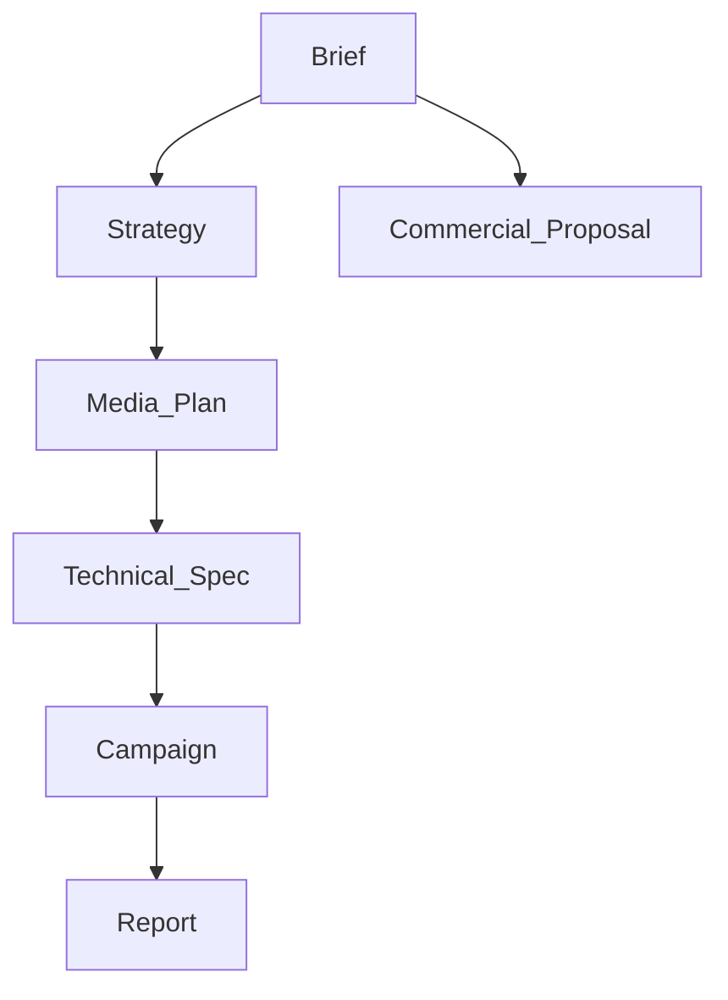
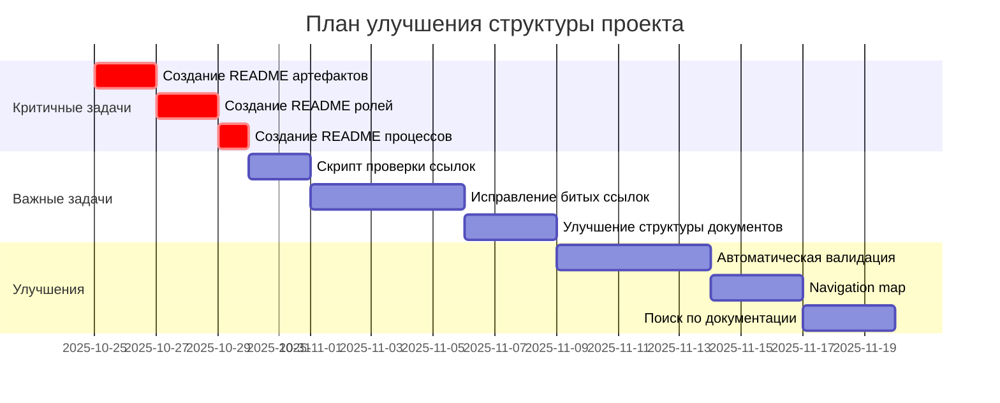

# 📊 Полный аудит структуры проекта MRM

**Дата проведения:** 24 октября 2025  
**Статус:** ✅ Завершен  
**Аудитор:** AI Assistant  
**Версия:** 1.0

---

## 🎯 Цель аудита

Проверка структуры проекта на соответствие best practices по:
- 📏 Размеру файлов и документации
- 🔗 Перелинковке между документами
- 📁 Организации файловой структуры
- 📖 Наличию README файлов
- ✅ Качеству документации
- 🔄 Связности и навигации

---

## 📈 ОБЩАЯ СТАТИСТИКА

### Файловая статистика
```yaml
Всего MD файлов: 352
Средний размер: 298 строк
Общий объем документации: ~105,000 строк

Распределение по размеру:
  Огромные (>1500 строк): 4 файла (1.1%)
  Большие (1000-1500 строк): 13 файлов (3.7%)
  Средние (500-1000 строк): 53 файла (15.1%)
  Малые (<500 строк): 282 файла (80.1%)
```

### Структура директорий
```yaml
00_PROJECT_OVERVIEW:     18 MD файлов,  0 поддиректорий
01_ROLES:                57 MD файлов,  7 поддиректорий
02_ARTIFACTS:            33 MD файла,  14 поддиректорий
03_TOOLS:                21 MD файл,   12 поддиректорий
04_PLATFORMS:            23 MD файла,  13 поддиректорий
05_PROCESSES:            54 MD файла,   8 поддиректорий
06_AI_ASSISTANTS:        13 MD файлов,  9 поддиректорий
07_INTEGRATIONS:         18 MD файлов, 13 поддиректорий
08_ARCHITECTURE:         17 MD файлов,  5 поддиректорий
09_DEVELOPMENT:          16 MD файлов,  2 поддиректории

Итого: 270 MD файлов в основных директориях
```

### Перелинковка
```yaml
Всего проверено ссылок: 632
Битых ссылок: 78 (12.3%)
Относительных ссылок: 642

Файлы с наибольшей перелинковкой:
  1. 00_PROJECT_OVERVIEW/README.md - 79 ссылок
  2. 01_ROLES/Specialist/_COMPLETE_GUIDE.md - 46 ссылок
  3. 11_BUSINESS/README.md - 21 ссылка
  4. 05_PROCESSES/_PROCESSES_FINAL_REPORT.md - 20 ссылок
```

---

## ✅ ЧТО РАБОТАЕТ ХОРОШО

### 1. 📏 Размер файлов (ОТЛИЧНО)
✅ **80% файлов меньше 500 строк** - оптимально для чтения  
✅ **Только 4 файла >1500 строк** - приемлемо для справочников  
✅ **Средний размер 298 строк** - идеальный баланс

**Оценка: 9/10** 🟢

**Примеры крупных файлов (допустимо для справочников):**
- `00_PROJECT_OVERVIEW/PRE_DEVELOPMENT_ACTION_PLAN.md` - 2075 строк
- `00_PROJECT_OVERVIEW/MVP_TECHNICAL_SPECIFICATION.md` - 2041 строк
- `11_BUSINESS/Sales_Process_And_Demo.md` - 1825 строк
- `11_BUSINESS/Financial_Model_Development_Plan.md` - 1583 строк

### 2. 🗂️ Организация структуры (ХОРОШО)
✅ **Четкая структура с номерацией** (00-15)  
✅ **Логическое разделение** по ролям, артефактам, процессам  
✅ **Консистентные названия** директорий  
✅ **Недавно организованы** отчеты в `_REPORTS/`, `_RESEARCH/`, etc.

**Оценка: 8/10** 🟢

### 3. 📊 Объем документации (ОТЛИЧНО)
✅ **352 MD файла** - comprehensive coverage  
✅ **~105,000 строк** документации  
✅ **Покрытие всех ролей** (7 ролей)  
✅ **Покрытие всех артефактов** (12 артефактов)  
✅ **Детализация процессов** (8 основных процессов)

**Оценка: 10/10** 🟢

### 4. 🔗 Перелинковка (УДОВЛЕТВОРИТЕЛЬНО)
✅ **632 проверенных ссылки** - хорошая связность  
✅ **Центральные файлы** с навигацией (README, Overview)  
✅ **Относительные пути** используются правильно

**Оценка: 7/10** 🟡

---

## ⚠️ ПРОБЛЕМЫ И ЗАМЕЧАНИЯ

### 1. 📖 Отсутствие README файлов (КРИТИЧНО)

**Проблема:** 112 директорий без README.md

**Критичные отсутствующие README:**

#### Артефакты (14 директорий)
```
❌ 02_ARTIFACTS/README.md
❌ 02_ARTIFACTS/Brief/README.md
❌ 02_ARTIFACTS/Media_Plan/README.md
❌ 02_ARTIFACTS/Strategy_Document/README.md
❌ 02_ARTIFACTS/Commercial_Proposal/README.md
❌ 02_ARTIFACTS/Project_Passport/README.md
❌ 02_ARTIFACTS/Campaign_Report/README.md
❌ 02_ARTIFACTS/Technical_Specification/README.md
❌ 02_ARTIFACTS/Tasks/README.md
❌ 02_ARTIFACTS/Team/README.md
❌ 02_ARTIFACTS/Communication/README.md
❌ 02_ARTIFACTS/RIM/README.md
❌ 02_ARTIFACTS/Budget_Model/README.md
❌ 02_ARTIFACTS/Products/README.md
```

#### Роли (8 директорий)
```
❌ 01_ROLES/README.md
❌ 01_ROLES/Account_Manager/README.md
❌ 01_ROLES/Project_Manager/README.md
❌ 01_ROLES/Strategist/README.md
❌ 01_ROLES/Specialist/README.md
❌ 01_ROLES/Analyst/README.md
❌ 01_ROLES/Creative/README.md
❌ 01_ROLES/Client/README.md
```

#### Процессы (9 директорий)
```
❌ 05_PROCESSES/README.md
❌ 05_PROCESSES/01_Briefing/README.md
❌ 05_PROCESSES/02_Strategy_Development/README.md
❌ 05_PROCESSES/03_Media_Planning/README.md
❌ 05_PROCESSES/04_Documentation/README.md
❌ 05_PROCESSES/05_Campaign_Preparation/README.md
❌ 05_PROCESSES/06_Launch_Monitoring/README.md
❌ 05_PROCESSES/07_Analytics_Optimization/README.md
❌ 05_PROCESSES/08_Next_Cycle_Planning/README.md
```

#### AI Ассистенты (10 директорий)
```
❌ 06_AI_ASSISTANTS/README.md
❌ 06_AI_ASSISTANTS/Account_Manager_Assistant/README.md
❌ 06_AI_ASSISTANTS/PM_Assistant/README.md
❌ 06_AI_ASSISTANTS/Strategist_Assistant/README.md
❌ 06_AI_ASSISTANTS/Specialist_Assistant/README.md
❌ 06_AI_ASSISTANTS/Analyst_Assistant/README.md
❌ 06_AI_ASSISTANTS/Brief_Generator/README.md
❌ 06_AI_ASSISTANTS/Media_Planner_Assistant/README.md
❌ 06_AI_ASSISTANTS/Account_Assistant/README.md
```

#### Инструменты (14 директорий)
```
❌ 03_TOOLS/README.md
❌ 03_TOOLS/Analytics_Tools/README.md
❌ 03_TOOLS/Reach_Calculator/README.md
❌ 03_TOOLS/Econometrics_Tool/README.md
... и другие
```

#### Платформы (15 директорий)
```
❌ 04_PLATFORMS/README.md
❌ 04_PLATFORMS/MEDIA_LANDSCAPE/README.md
❌ 04_PLATFORMS/Context_Advertising/README.md
❌ 04_PLATFORMS/Social_Media/README.md
... и другие
```

**Оценка: 3/10** 🔴

**Воздействие:**
- ❌ Сложная навигация для новых участников
- ❌ Непонятно, что содержит каждая директория
- ❌ Нет быстрого обзора содержимого
- ❌ Затруднен onboarding

---

### 2. 🔗 Битые ссылки (ВАЖНО)

**Проблема:** 78 битых ссылок из 632 (12.3%)

**Причины:**
- Переименование файлов
- Перемещение в `_REPORTS/`, `_RESEARCH/` и т.д.
- Удаление устаревших документов
- Опечатки в путях

**Оценка: 6/10** 🟡

**Воздействие:**
- ⚠️ Разрыв навигации между документами
- ⚠️ Потеря контекста при чтении
- ⚠️ Плохой UX для разработчиков

---

### 3. 📑 Структура документов (НЕРАВНОМЕРНО)

**Проблема:** Неравномерное качество структурирования

**Примеры слабо структурированных файлов:**
```
⚠️ 01_ROLES/Strategist/Pain_Points.md: 3 раздела (мало)
⚠️ 01_ROLES/Account_Manager/Pain_Points.md: 4 раздела (мало)
⚠️ 01_ROLES/Project_Manager/Pain_Points.md: 3 раздела (мало)
⚠️ 01_ROLES/Analyst/Pain_Points.md: 3 раздела (мало)
⚠️ 01_ROLES/*/_COMPLETE_GUIDE.md: 2 раздела (мало)
```

**Хорошо структурированные файлы:**
```
✅ 01_ROLES/*/AI_Assistant.md: 6-11 разделов
✅ 01_ROLES/*/RACI_Matrix.md: 6-13 разделов
✅ 01_ROLES/*/Role_Description.md: 7-9 разделов
```

**Оценка: 7/10** 🟡

---

### 4. 🔄 Дублирование информации (УМЕРЕННО)

**Проблема:** Некоторая информация дублируется

**Примеры:**
- Overview файлы vs детальные файлы в папках
- Complete Guide vs отдельные файлы ролей
- Final Report vs Session Report

**Оценка: 7/10** 🟡

**Примечание:** Некоторое дублирование допустимо для удобства навигации

---

## 📊 ИТОГОВАЯ ОЦЕНКА ПО КАТЕГОРИЯМ

| Категория | Оценка | Статус | Приоритет исправления |
|-----------|--------|--------|-----------------------|
| **Размер файлов** | 9/10 | 🟢 Отлично | - |
| **Организация структуры** | 8/10 | 🟢 Хорошо | Низкий |
| **Объем документации** | 10/10 | 🟢 Отлично | - |
| **Наличие README** | 3/10 | 🔴 Критично | **ВЫСОКИЙ** |
| **Перелинковка** | 7/10 | 🟡 Удовл. | Средний |
| **Битые ссылки** | 6/10 | 🟡 Требует внимания | Средний |
| **Структура документов** | 7/10 | 🟡 Удовл. | Низкий |
| **Дублирование** | 7/10 | 🟡 Допустимо | Низкий |

### Общая оценка: **7.1/10** 🟡

---

## 🎯 РЕКОМЕНДАЦИИ ПО УЛУЧШЕНИЮ

### 🔴 ПРИОРИТЕТ 1: Критичные (срочно)

#### 1.1 Создать README.md для всех основных директорий

**Цель:** Улучшить навигацию и onboarding

**Что делать:**
1. **Создать 02_ARTIFACTS/README.md** - overview всех артефактов
2. **Создать README в каждой папке артефакта** (14 файлов)
3. **Создать 01_ROLES/README.md** - overview всех ролей
4. **Создать README в каждой папке роли** (7 файлов)
5. **Создать 05_PROCESSES/README.md** - overview процессов
6. **Создать README в каждом процессе** (8 файлов)
7. **Создать 06_AI_ASSISTANTS/README.md** - overview ассистентов

**Структура README:**
```markdown
# [Название директории]

## 🎯 Назначение
Краткое описание (2-3 предложения)

## 📁 Содержимое
Список файлов с кратким описанием

## 🔗 Связанные документы
Ссылки на связанные разделы

## 🚀 Быстрый старт
Для новых пользователей - с чего начать

## 📊 Статус
Готовность секции
```

**Оценка времени:** 8-12 часов  
**Приоритет:** 🔴 P0  
**Deadline:** В течение недели

---

### 🟡 ПРИОРИТЕТ 2: Важные (в течение месяца)

#### 2.1 Исправить битые ссылки

**Цель:** Восстановить навигацию между документами

**План:**
1. **Автоматическая проверка:** Создать скрипт для поиска битых ссылок
2. **Классификация:** Разделить на:
   - Устаревшие (удалить ссылку)
   - Перемещенные (обновить путь)
   - Опечатки (исправить)
3. **Массовое исправление:** Использовать find & replace
4. **Валидация:** Повторная проверка

**Инструменты:**
```python
# Скрипт для проверки ссылок
import re
from pathlib import Path

def validate_links(root_dir):
    # ... implementation
    pass
```

**Оценка времени:** 4-6 часов  
**Приоритет:** 🟡 P1

---

#### 2.2 Улучшить структуру слабых документов

**Цель:** Единообразие и полнота документации

**Файлы для улучшения:**
- `*/_COMPLETE_GUIDE.md` - добавить разделы
- `*/Pain_Points.md` - детализировать pain points
- `*/Tools_Access.md` - добавить примеры

**Шаблон структуры:**
```markdown
## 🎯 Обзор
## 📋 Детальное описание
## 💡 Примеры
## 🔗 Связанные документы
## ✅ Checklist
```

**Оценка времени:** 6-8 часов  
**Приоритет:** 🟡 P1

---

#### 2.3 Оптимизировать крупные файлы

**Цель:** Разбить файлы >1500 строк на модули

**Файлы:**
1. `PRE_DEVELOPMENT_ACTION_PLAN.md` (2075) → разбить на фазы
2. `MVP_TECHNICAL_SPECIFICATION.md` (2041) → разбить по компонентам
3. `Sales_Process_And_Demo.md` (1825) → разделить на этапы

**Подход:**
- Создать папку с модулями
- Главный файл = оглавление + ссылки
- Модули = отдельные файлы по темам

**Оценка времени:** 3-4 часа  
**Приоритет:** 🟡 P2

---

### 🟢 ПРИОРИТЕТ 3: Улучшения (опционально)

#### 3.1 Создать автоматическую валидацию

**Цель:** Предотвратить проблемы в будущем

**Что создать:**
1. **Pre-commit hook:**
   - Проверка битых ссылок
   - Проверка наличия frontmatter
   - Проверка структуры
   
2. **CI/CD pipeline:**
   - Автоматическая проверка при PR
   - Генерация отчетов
   - Блокировка merge при критичных ошибках

3. **Документация validator:**
   ```yaml
   rules:
     - no_broken_links: error
     - readme_required: warn
     - min_sections: 3
     - max_file_size: 2000
   ```

**Оценка времени:** 8-10 часов  
**Приоритет:** 🟢 P3

---

#### 3.2 Создать navigation map

**Цель:** Интерактивная карта проекта

**Формат:**
- Mermaid диаграммы связей
- Interactive HTML map
- Auto-generated TOC

**Пример:**


**Оценка времени:** 4-6 часов  
**Приоритет:** 🟢 P3

---

#### 3.3 Добавить поиск по документации

**Цель:** Быстрый доступ к информации

**Инструменты:**
- Algolia DocSearch
- Local search с Lunr.js
- Full-text search в GitBook

**Оценка времени:** 6-8 часов  
**Приоритет:** 🟢 P3

---

## 📋 ПЛАН ДЕЙСТВИЙ (Action Plan)

### Неделя 1: Критичные задачи
```yaml
День 1-2:
  - [ ] Создать шаблон README.md
  - [ ] Создать README для всех артефактов (14 файлов)
  
День 3-4:
  - [ ] Создать README для всех ролей (7 файлов)
  - [ ] Создать README для процессов (8 файлов)
  
День 5:
  - [ ] Создать README для AI ассистентов
  - [ ] Создать README для инструментов
  - [ ] Review и корректировки
```

### Неделя 2-3: Важные задачи
```yaml
Неделя 2:
  - [ ] Разработать скрипт проверки ссылок
  - [ ] Запустить и собрать список битых ссылок
  - [ ] Исправить 50% битых ссылок
  
Неделя 3:
  - [ ] Исправить оставшиеся битые ссылки
  - [ ] Улучшить структуру слабых документов
  - [ ] Оптимизировать крупные файлы
```

### Месяц 2: Улучшения
```yaml
- [ ] Создать автоматическую валидацию
- [ ] Внедрить pre-commit hooks
- [ ] Создать navigation map
- [ ] Добавить поиск (опционально)
```

---

## 📊 МЕТРИКИ УСПЕХА

### Текущие показатели (baseline)
```yaml
README coverage: 15% (17 из 112 директорий)
Broken links: 12.3% (78 из 632)
Avg file size: 298 строк
Documentation completeness: 70%
```

### Целевые показатели (target)
```yaml
README coverage: 95%+ (107+ из 112)
Broken links: <2% (<13 из 632)
Avg file size: 250-350 строк
Documentation completeness: 90%+
```

### KPI для отслеживания
```yaml
Еженедельно:
  - Количество созданных README
  - Количество исправленных ссылок
  - Среднее время на onboarding нового разработчика

Ежемесячно:
  - Полнота документации
  - Качество структуры (audit score)
  - Удовлетворенность команды (опрос)
```

---

## 🎓 BEST PRACTICES ДЛЯ ПОДДЕРЖАНИЯ КАЧЕСТВА

### 1. Правило создания новых файлов
```yaml
При создании нового файла:
  ✅ Добавить frontmatter с метаданными
  ✅ Структурировать с минимум 3 разделами
  ✅ Добавить ссылки на связанные документы
  ✅ Обновить README родительской директории
  ✅ Проверить размер (<1000 строк идеально)
```

### 2. Правило создания новых директорий
```yaml
При создании новой директории:
  ✅ Создать README.md сразу
  ✅ Добавить ссылку в родительский README
  ✅ Добавить в navigation map
  ✅ Документировать purpose и содержимое
```

### 3. Правило рефакторинга
```yaml
При перемещении/переименовании:
  ✅ Обновить все ссылки на файл
  ✅ Добавить redirect или примечание
  ✅ Обновить README
  ✅ Запустить валидатор ссылок
```

### 4. Правило review
```yaml
Перед commit:
  ✅ Проверить линтером markdown
  ✅ Проверить битые ссылки
  ✅ Проверить frontmatter
  ✅ Review размера файла
```

---

## 🔧 ИНСТРУМЕНТЫ ДЛЯ АВТОМАТИЗАЦИИ

### Рекомендуемые инструменты

#### 1. Markdown Linter
```bash
# Installation
npm install -g markdownlint-cli

# Usage
markdownlint '**/*.md' --config .markdownlint.json
```

#### 2. Link Checker
```bash
# Installation
npm install -g markdown-link-check

# Usage
find . -name "*.md" -exec markdown-link-check {} \;
```

#### 3. Documentation Generator
```bash
# Installation
npm install -g jsdoc-to-markdown

# For generating TOC
npm install -g doctoc
```

#### 4. Pre-commit hooks
```yaml
# .pre-commit-config.yaml
repos:
  - repo: https://github.com/pre-commit/mirrors-markdownlint
    hooks:
      - id: markdownlint
        args: [--fix]
  
  - repo: local
    hooks:
      - id: check-broken-links
        name: Check for broken links
        entry: python scripts/check_links.py
        language: python
```

---

## 📈 ПРОГРЕСС И ОТЧЕТНОСТЬ

### Еженедельный отчет (шаблон)
```markdown
## Неделя [N]: [Дата]

### Выполнено:
- [x] Создано README: 5 файлов
- [x] Исправлено ссылок: 12
- [x] Улучшено документов: 3

### Метрики:
- README coverage: 25% → 35% (+10%)
- Broken links: 78 → 66 (-12)

### Следующая неделя:
- [ ] Создать README для процессов
- [ ] Исправить ссылки в 01_ROLES
```

---

## 🎯 ВЫВОДЫ

### Сильные стороны проекта
✅ **Отличная организация** - четкая структура с номерацией  
✅ **Comprehensive coverage** - 352 MD файла, все области покрыты  
✅ **Оптимальные размеры** - 80% файлов <500 строк  
✅ **Активная перелинковка** - 632 ссылки между документами  
✅ **Недавний рефакторинг** - организованы отчеты и исследования

### Основные проблемы
❌ **Отсутствие README** - 112 директорий без README.md  
⚠️ **Битые ссылки** - 78 битых ссылок (12.3%)  
⚠️ **Неравномерное качество** - некоторые файлы слабо структурированы

### Общий вердикт
**Оценка: 7.1/10** - Хорошая база, но требуется работа над навигацией и связностью

**Рекомендация:** Приоритизировать создание README файлов (1-2 недели работы) для драматического улучшения usability проекта.

---

## 🔗 СВЯЗАННЫЕ ДОКУМЕНТЫ

- [Project Organization Report](./PROJECT_ORGANIZATION_REPORT.md) - отчет об организации файлов
- [Documentation Standards](../09_DEVELOPMENT/DOCUMENTATION_STANDARDS.md) - стандарты документации
- [README Template](../13_DOCUMENTATION/README_TEMPLATE.md) - шаблон README (нужно создать)
- [Contribution Guidelines](../13_DOCUMENTATION/CONTRIBUTING.md) - правила контрибуции

---

## 📅 ГРАФИК ИСПОЛНЕНИЯ



---

**Подготовлено:** AI Assistant  
**Дата:** 24 октября 2025  
**Версия:** 1.0  
**Статус:** ✅ Готов к действию

**Следующий шаг:** Начать с создания README файлов для критичных директорий

