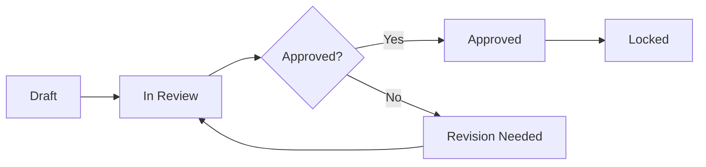

# 📝 Brief - Бриф клиента

> **Входная точка проекта:** Описание целей, аудитории и требований клиента

---

## 🎯 Назначение

Brief (Бриф) — это первый и ключевой документ рекламного проекта. Он содержит структурированное описание бизнес-целей клиента, целевой аудитории, бюджета и требований к кампании.

**Ключевые функции:**
- 📥 Входная точка для всех последующих артефактов
- 🎯 Фиксация целей и ожиданий клиента
- 💰 Определение бюджетных рамок
- 📊 Базовая информация для AI-генерации стратегии
- ✅ Контрольный документ для приемки результатов

**Влияние:** Brief → Strategy_Document, Media_Plan, Commercial_Proposal

---

## 📁 Содержимое

| Файл | Описание | Статус |
|------|----------|--------|
| [`Data_Structure.md`](./Data_Structure.md) | JSON Schema с полями брифа | ✅ 100% |
| [`UI_Template_Web.md`](./UI_Template_Web.md) | Web UI (5-шаговая форма) | ✅ 100% |
| [`Validation_Rules.md`](./Validation_Rules.md) | Правила валидации и workflow | ✅ 100% |
| [`Prototype_Specification.md`](./Prototype_Specification.md) | ТЗ на прототип экрана | ✅ 100% |
| `UI_Template_Sheets.md` | Google Sheets шаблон | ⏳ TODO |
| `Examples.md` | Примеры заполненных брифов | ⏳ TODO |
| `API_Endpoints.md` | REST API endpoints | ⏳ TODO |
| `AI_Features.md` | AI автозаполнение и подсказки | ⏳ TODO |

**Готовность:** 67% ✅

---

## 🚀 Быстрый старт

### Для клиента (заполнение брифа)
1. Откройте веб-форму или получите ссылку от Account Manager
2. Заполните 5 шагов:
   - **Шаг 1:** Информация о компании
   - **Шаг 2:** Цели кампании
   - **Шаг 3:** Целевая аудитория
   - **Шаг 4:** Бюджет и сроки
   - **Шаг 5:** Каналы и дополнительно
3. AI автоматически подскажет типичные значения
4. Отправьте бриф на согласование

### Для Account Manager
1. Создайте новый бриф для клиента
2. Помогите заполнить сложные поля
3. Используйте AI для автозаполнения из CRM
4. Согласуйте с клиентом и PM
5. Зафиксируйте финальную версию

### Для Strategist
1. Получите утвержденный бриф от PM
2. Изучите цели, аудиторию и бюджет
3. Используйте бриф как базу для Strategy_Document
4. AI автоматически предложит каналы и тактики

---

## 📊 Структура данных

### Основные секции (11 блоков)

```yaml
Brief:
  1. briefId, clientId, status, version
  2. clientInfo: company, industry, contact, website
  3. campaignGoals: objectives, kpis, successCriteria
  4. targetAudience: demographics, psychographics, pain_points
  5. budget: total, breakdown, flexibility
  6. timeline: start, end, milestones
  7. channels: preferred, restrictions
  8. creativeRequirements: format, tone, assets
  9. competitorsAnalysis: competitors, differentiation
  10. additionalInfo: constraints, notes
  11. approvals: workflow, signatures
```

**Полная схема:** См. [`Data_Structure.md`](./Data_Structure.md)

---

## 🤖 AI Возможности

### Автозаполнение (70% полей)
- ✅ **Из CRM:** Название компании, контакты, история
- ✅ **Из предыдущих кампаний:** Типичный бюджет, аудитория
- ✅ **Из индустрии:** Средние KPI, best practices
- ✅ **Из анализа конкурентов:** Автоматический сбор данных

### Валидация и подсказки
- ✅ **Проверка completeness:** Все ли обязательные поля заполнены
- ✅ **Cross-field validation:** Бюджет vs цели, timeline vs каналы
- ✅ **Smart suggestions:** AI предлагает каналы на основе аудитории
- ✅ **Warning alerts:** Потенциальные проблемы (например, низкий бюджет)

### Генерация следующих артефактов
- Brief → Strategy_Document (60% автогенерация)
- Brief → Media_Plan (каналы и распределение бюджета)
- Brief → Commercial_Proposal (оценка стоимости)

**Подробнее:** См. [`06_AI_ASSISTANTS/Brief_Generator/`](../../06_AI_ASSISTANTS/Brief_Generator/)

---

## 🔗 Связанные документы

### Создается из
- **CRM данные** (AmoCRM, Битрикс24)
- **Email переписка** с клиентом
- **Предыдущие кампании** (если есть история)

### Порождает
- [`Strategy_Document`](../Strategy_Document/) - Стратегический документ
- [`Media_Plan`](../Media_Plan/) - Медиаплан
- [`Commercial_Proposal`](../Commercial_Proposal/) - Коммерческое предложение
- [`Project_Passport`](../Project_Passport/) - Паспорт проекта

### Используется ролями
- [Account Manager](../../01_ROLES/Account_Manager/) - Создает/редактирует
- [Client](../../01_ROLES/Client/) - Заполняет/утверждает
- [Strategist](../../01_ROLES/Strategist/) - Анализирует
- [Project Manager](../../01_ROLES/Project_Manager/) - Согласовывает
- [Specialist](../../01_ROLES/Specialist/) - Использует для планирования

---

## 👥 RACI Матрица

| Действие | Client | Account Mgr | PM | Strategist | Specialist |
|----------|--------|-------------|----|-----------| -----------|
| **Создание брифа** | C | R | A | I | I |
| **Заполнение данных** | R | R | C | I | I |
| **Валидация** | I | C | R | C | I |
| **Утверждение** | A | R | A | I | I |
| **Использование** | I | I | C | R | R |

**Легенда:**
- **R** - Responsible (выполняет)
- **A** - Accountable (отвечает)
- **C** - Consulted (консультируется)
- **I** - Informed (информируется)

---

## 📊 Workflow и статусы



### Статусы
1. **Draft** - Заполняется клиентом/AM
2. **In Review** - На согласовании
3. **Revision Needed** - Требуются уточнения
4. **Approved** - Утвержден
5. **Locked** - Зафиксирован, нельзя изменить

**Подробнее:** См. [`Validation_Rules.md`](./Validation_Rules.md)

---

## 💰 Экономия времени

### До автоматизации
```yaml
Сбор информации: 1-2 часа
Оформление документа: 1 час
Согласование (итерации): 1-2 часа
Передача следующим этапам: 0.5 часа

ИТОГО: 3.5-5.5 часов
```

### С AI автоматизацией
```yaml
Заполнение формы с AI: 20-30 минут
Проверка и корректировки: 10-15 минут
Согласование (ускорено): 20-30 минут
Автопередача: 0 минут

ИТОГО: 50-75 минут
```

**Экономия: 2.5-4 часа на бриф (70%)**

---

## 📋 Checklist для заполнения

### Обязательные поля
- [ ] Название компании и индустрия
- [ ] Контактное лицо (имя, email, телефон)
- [ ] Минимум 1 цель кампании
- [ ] Минимум 1 KPI
- [ ] Целевая аудитория (демография)
- [ ] Общий бюджет
- [ ] Даты начала и окончания
- [ ] Минимум 1 предпочтительный канал

### Рекомендуемые поля
- [ ] Website и социальные сети
- [ ] Детальная психография аудитории
- [ ] Pain points аудитории
- [ ] Креативные требования
- [ ] Анализ конкурентов (минимум 3)
- [ ] Ограничения и особенности
- [ ] Прикрепленные файлы (brand book, previous campaigns)

### Валидация перед отправкой
- [ ] Все обязательные поля заполнены
- [ ] Бюджет соответствует целям
- [ ] Timeline реалистичный
- [ ] KPI измеримы
- [ ] Нет противоречий между полями

**Автоматическая проверка:** AI выделит незаполненные/проблемные поля

---

## 💡 Best Practices

### Для клиентов
- 💡 **Будьте конкретны:** "Увеличить продажи на 20%" лучше, чем "Увеличить продажи"
- 💡 **Укажите реальные цифры:** AI даст более точные рекомендации
- 💡 **Не стесняйтесь задавать вопросы:** Account Manager поможет

### Для Account Manager
- 💡 **Используйте AI подсказки:** Они основаны на успешных кейсах
- 💡 **Проверяйте completeness:** Неполный бриф = проблемы на следующих этапах
- 💡 **Сохраняйте версии:** История изменений важна

### Частые ошибки
- ❌ Слишком общие цели ("повысить узнаваемость")
- ❌ Нереалистичный бюджет для заявленных целей
- ❌ Отсутствие KPI или неизмеримые KPI
- ❌ Слишком широкая или неопределенная аудитория
- ❌ Противоречивые требования (низкий бюджет + много каналов)

---

## 🔧 Технические детали

### Формат хранения
- **Database:** PostgreSQL (JSON column)
- **File storage:** S3 (attachments)
- **Vector DB:** Pinecone (для AI similarity search)

### API Endpoints
```
POST   /api/briefs              # Создать новый бриф
GET    /api/briefs/:id          # Получить бриф
PUT    /api/briefs/:id          # Обновить бриф
PATCH  /api/briefs/:id/status   # Изменить статус
GET    /api/briefs/:id/versions # История версий
POST   /api/briefs/:id/approve  # Утвердить
```

### Integrations
- **CRM:** Автозагрузка client info
- **Email:** Парсинг брифов из переписки
- **Calendar:** Синхронизация дедлайнов
- **AI:** OpenAI/Claude для автозаполнения

---

## ❓ FAQ

**Q: Можно ли изменить бриф после утверждения?**  
A: Да, но создается новая версия, а старая блокируется. Все связанные артефакты получат уведомление.

**Q: Что делать, если клиент не знает ответ на какой-то вопрос?**  
A: Пропустите поле или используйте AI подсказку. Account Manager поможет уточнить позже.

**Q: Как долго создается бриф?**  
A: С AI помощью - 30-60 минут. Вручную - 3-5 часов.

**Q: Можно ли импортировать бриф из другой системы?**  
A: Да, поддерживается импорт из Excel, Google Forms, email.

---

## 📞 Контакты

- **Вопросы по заполнению:** Account Manager вашего проекта
- **Технические проблемы:** [GitHub Issues](https://github.com/georgiymarchenkov/ai_mrm/issues)
- **Предложения по улучшению:** Product Team

---

**Версия:** 1.0  
**Последнее обновление:** 24 октября 2025  
**Готовность:** 67% ✅  
**Приоритет:** 🔴 P0 (критичный для MVP)  
**Статус:** ⏳ В разработке

