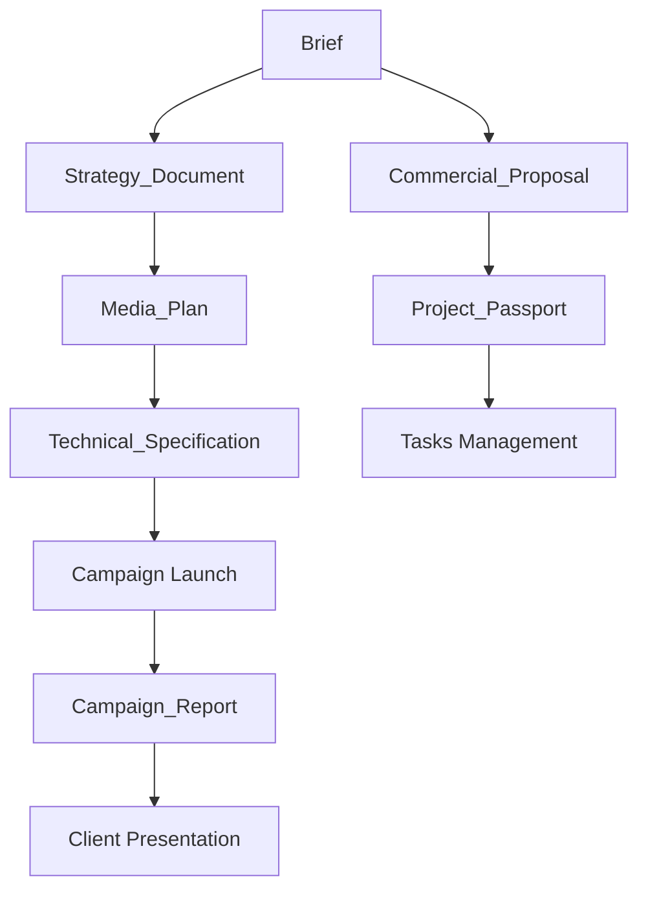

# 📋 Артефакты MRM системы

> **Ключевые документы и данные рекламных проектов:** От брифа до финального отчета

---

## 🎯 Назначение

Артефакты — это структурированные документы и данные, которые создаются и используются на протяжении всего жизненного цикла рекламного проекта. Они обеспечивают прозрачность, контроль и автоматизацию процессов агентства.

**Всего артефактов:** 12 (8 MVP + 4 Post-MVP)  
**Экономия времени:** 40-60 часов на проект (75-80%)  
**Формат:** JSON Schema + Web UI + Google Sheets

---

## 📁 Содержимое

### 🔴 MVP Артефакты (критичные для запуска)

| № | Артефакт | Создает | Статус | Файлов |
|---|----------|---------|--------|--------|
| 1 | [Brief](./Brief/) | Client, Account Manager | ✅ 67% | 8 |
| 2 | [Project_Passport](./Project_Passport/) | Project Manager | ⏳ 30% | 2 |
| 3 | [Commercial_Proposal](./Commercial_Proposal/) | PM, Account Manager | 📝 10% | 1 |
| 4 | [Strategy_Document](./Strategy_Document/) | Strategist | ✅ 50% | 4 |
| 5 | [Media_Plan](./Media_Plan/) | Specialist | ✅ 60% | 5 |
| 6 | [Technical_Specification](./Technical_Specification/) | Specialist, PM | 📝 10% | 1 |
| 7 | [Campaign_Report](./Campaign_Report/) | Analyst, Specialist | ⏳ 20% | 2 |
| 8 | [Tasks](./Tasks/) | Project Manager | 📝 5% | 1 |

### 🟡 Post-MVP Артефакты (дополнительные)

| № | Артефакт | Создает | Статус | Файлов |
|---|----------|---------|--------|--------|
| 9 | [Team](./Team/) | HR, PM | 📝 5% | 1 |
| 10 | [Communication](./Communication/) | All | 📝 5% | 1 |
| 11 | [RIM](./RIM/) | PM | 📝 5% | 1 |
| 12 | [Products](./Products/) | Creative | 📝 5% | 1 |

**Легенда:** ✅ Готово | ⏳ В работе | 📝 Спроектировано

---

## 🚀 Быстрый старт

### Для новых пользователей
1. **Начните с обзора:** [`_Artifacts_Overview.md`](./_Artifacts_Overview.md) - полное описание всех артефактов
2. **Изучите структуру:** Каждый артефакт имеет 6 стандартных файлов (см. ниже)
3. **Посмотрите примеры:** Папка `Brief/` содержит наиболее полную документацию

### Стандартная структура артефакта

Каждый артефакт содержит:
```
[Artifact_Name]/
  ├── README.md                    # Обзор артефакта (вы здесь)
  ├── Data_Structure.md            # JSON Schema
  ├── UI_Template_Web.md           # Web UI спецификация
  ├── UI_Template_Sheets.md        # Google Sheets шаблон
  ├── Validation_Rules.md          # Правила валидации
  ├── Examples.md                  # Примеры использования
  └── API_Endpoints.md             # REST API спецификация
```

---

## 🔄 Жизненный цикл артефактов



### Последовательность создания

1. **Kickoff:** `Brief` → `Project_Passport` → `Tasks`
2. **Planning:** `Strategy_Document` → `Media_Plan` → `Commercial_Proposal`
3. **Execution:** `Technical_Specification` → Campaign Launch
4. **Monitoring:** `Campaign_Report` (ongoing)
5. **Closeout:** Final `Campaign_Report` → Archive

---

## 🔗 Связанные документы

### В этом разделе
- [`_Artifacts_Overview.md`](./_Artifacts_Overview.md) - Детальный обзор всех 12 артефактов
- [`Brief/`](./Brief/) - Наиболее проработанный пример артефакта

### В других разделах
- [Роли](../01_ROLES/) - Кто создает и использует артефакты
- [Процессы](../05_PROCESSES/) - Как артефакты используются в процессах
- [AI Ассистенты](../06_AI_ASSISTANTS/) - AI помощь с артефактами
- [Архитектура данных](../08_ARCHITECTURE/Project_Data_Architecture.md)

### Общая документация
- [Главная страница проекта](../README.md)
- [MVP Спецификация](../00_PROJECT_OVERVIEW/MVP_TECHNICAL_SPECIFICATION.md)

---

## 👥 Целевая аудитория

| Роль | Использование | Частота |
|------|---------------|---------|
| **Account Manager** | Brief, Commercial_Proposal, Communication | Ежедневно |
| **Project Manager** | Project_Passport, Tasks, RIM | Ежедневно |
| **Strategist** | Brief → Strategy_Document | Еженедельно |
| **Specialist** | Media_Plan, Technical_Specification | Ежедневно |
| **Analyst** | Campaign_Report, всех для анализа | Еженедельно |
| **Client** | Brief (создание), все остальные (просмотр) | По запросу |

---

## 📊 Статус и метрики

**Готовность раздела:** 35% ⏳

**Метрики:**
- Всего артефактов: 12
- MVP готовность: 30% (в среднем)
- Количество MD файлов: 33
- Последнее обновление: 24 октября 2025

**Приоритет разработки (MVP):**
1. ✅ Brief (67%) - почти готов
2. ⏳ Media_Plan (60%) - в работе
3. ⏳ Strategy_Document (50%) - в работе
4. ⏳ Project_Passport (30%) - требуется доработка
5. 📝 Остальные (<20%) - в очереди

---

## 💾 Форматы и интеграции

### Форматы хранения
- **JSON** - основной формат хранения (PostgreSQL)
- **Google Sheets** - для Media_Plan, Technical_Specification
- **PDF/PPT** - для Strategy_Document, Campaign_Report

### AI Возможности
- ✅ **Автогенерация:** Brief → 70% полей из CRM
- ✅ **Валидация:** Автоматическая проверка completeness
- ✅ **Оптимизация:** Media_Plan AI-оптимизация бюджета
- ✅ **Инсайты:** Campaign_Report AI-анализ аномалий

### Интеграции
- **CRM:** AmoCRM, Битрикс24 (автозаполнение Brief)
- **Ad Platforms:** YD, VK, Google (Campaign_Report)
- **Analytics:** Яндекс.Метрика, GA4 (Campaign_Report)
- **PM Tools:** Jira, Asana (Tasks синхронизация)

---

## ⚡ Быстрые ссылки

**Начать работу с артефактами:**
1. [Brief - пример готового артефакта](./Brief/)
2. [Media_Plan - работа с данными](./Media_Plan/)
3. [Обзор всех артефактов](./_Artifacts_Overview.md)

**Для разработчиков:**
1. [Data Architecture](../08_ARCHITECTURE/Project_Data_Architecture.md)
2. [API Specification](../08_ARCHITECTURE/API_Specification.md)
3. [UI/UX Guidelines](../15_PRODUCT_DESIGN/)

---

## 💡 Best Practices

- 💡 **Версионирование:** Каждое изменение артефакта создает новую версию
- 💡 **RACI матрица:** Всегда указывайте Responsible и Accountable роли
- 💡 **Валидация:** Проверяйте completeness перед передачей следующей роли
- ⚠️ **Важно:** Артефакты связаны - изменение Brief влияет на всю цепочку

---

## ❓ FAQ

**Q: Почему 12 артефактов, а не больше?**  
A: Это оптимальный набор для покрытия 80% потребностей агентства. Дополнительные артефакты можно добавить через расширения.

**Q: Можно ли использовать только часть артефактов?**  
A: Да. MVP включает 8 критичных артефактов. Остальные 4 - опциональные для Post-MVP.

**Q: Как артефакты связаны между собой?**  
A: Артефакты образуют DAG (направленный ациклический граф). См. диаграмму в разделе "Жизненный цикл".

**Q: Где хранятся артефакты?**  
A: PostgreSQL для структурированных данных, S3 для файлов, Vector DB для AI-индексации.

---

## 🔧 Для разработчиков

### Добавление нового артефакта

1. Создайте папку `02_ARTIFACTS/[New_Artifact]/`
2. Скопируйте шаблон из `Brief/` или используйте [`README_TEMPLATE.md`](../13_DOCUMENTATION/README_TEMPLATE.md)
3. Создайте 6 обязательных файлов (см. "Стандартная структура")
4. Обновите `_Artifacts_Overview.md`
5. Добавьте в эту таблицу и в диаграмму lifecycle

### Naming conventions
- **Артефакты:** PascalCase (`Media_Plan`, `Brief`)
- **Файлы:** PascalCase (`Data_Structure.md`)
- **JSON поля:** snake_case (`client_id`, `budget_total`)

---

## 📞 Контакты и поддержка

- **Вопросы по артефактам:** Product Manager, Architect
- **Разработка новых артефактов:** Architecture Team
- **Предложения:** [GitHub Issues](https://github.com/georgiymarchenkov/ai_mrm/issues)

---

**Версия:** 1.0  
**Последнее обновление:** 24 октября 2025  
**Ответственный:** Architecture Team  
**Статус:** ⏳ В разработке (35% готовности)

