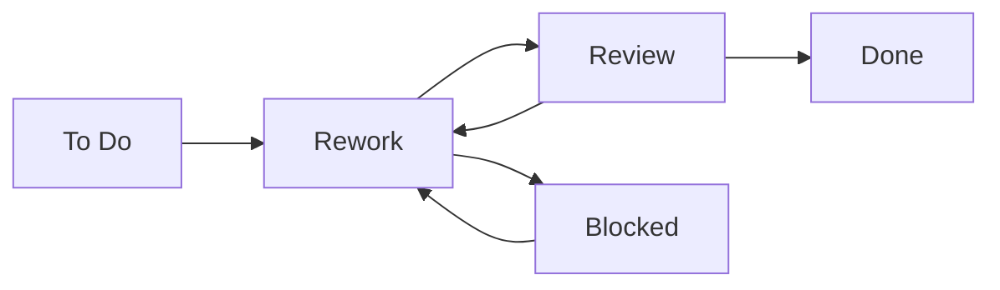

# Tasks - Задачи проекта

→ [Artifacts](../_README.md)

---

## 🎯 Назначение

**Tasks** - структурированный список задач по проекту с отслеживанием статуса.

**Содержит:**
- Все задачи проекта
- Assignees (исполнители)
- Deadlines (сроки)
- Статусы (To Do, In Progress, Done)
- Dependencies (зависимости между задачами)

---

## 📋 Структура задачи

### Task Card

```yaml
Task_ID: TASK_001
Title: "Создать медиаплан для Q1 2026"
Description: >
  Разработать детальный медиаплан на 100-150 строк размещений
  с распределением бюджета 10М₽ по каналам

Assignee: Specialist (Сидоров П.)
Reporter: PM (Иванов И.)

Priority: High
Status: In Progress

Start_Date: 2025-10-15
Due_Date: 2025-10-25
Estimated_Hours: 40h
Actual_Hours: 28h (ongoing)

Dependencies:
  - TASK_000: "Strategy approved" (Done)

Subtasks:
  - [ ] Анализ ЦА
  - [x] Выбор каналов
  - [x] Расчет GRP
  - [ ] Распределение бюджета
  - [ ] Детализация по неделям

Related_Artifacts:
  - Strategy: /artifacts/strategy_001.pdf
  - Brief: /artifacts/brief_001.xlsx
```

---

## 📊 Task Board (Kanban)

```
┌─────────────┬──────────────┬──────────────┬────────────┐
│   To Do     │ In Progress  │   Review     │    Done    │
├─────────────┼──────────────┼──────────────┼────────────┤
│ TASK_005    │ TASK_001     │ TASK_003     │ TASK_000   │
│ Create      │ Media Plan   │ Strategy     │ Briefing   │
│ Creatives   │              │ Doc          │            │
│             │ TASK_002     │              │            │
│ TASK_007    │ Setup        │              │            │
│ Analytics   │ Campaigns    │              │            │
└─────────────┴──────────────┴──────────────┴────────────┘
```

---

## 🔄 Жизненный цикл задачи



**Статусы:**
- **To Do** - запланирована, не начата
- **In Progress** - выполняется
- **Review** - на проверке у PM/Client
- **Blocked** - заблокирована (ждет dependency)
- **Done** - завершена

---

## 🔗 Интеграции

### Bitrix24
```yaml
Sync:
  - Задачи создаются автоматически из шаблона проекта
  - Assignees синхронизируются с CRM
  - Deadlines отображаются в календаре
  - Notifications при изменении статуса
```

### Jira (опционально)
```yaml
Export:
  - Epic: Проект
  - Stories: Основные задачи
  - Subtasks: Подзадачи
  - Sprint planning: По неделям
```

---

## 📈 Метрики

### Task Completion Rate

```
Total Tasks: 50
Done: 35 (70%)
In Progress: 10 (20%)
To Do: 5 (10%)

On Track: 90% (45/50 в срок)
Overdue: 5 (10%)
```

### Velocity

```
Avg tasks/week: 8
Current sprint: 12 tasks planned
Burndown: On track
```

---

## 👥 Роли

**Owner:** PM  
**Create tasks:** PM, Account  
**Assign:** PM  
**Execute:** All team  
**Track:** PM (daily standup)

---

## 🎯 Best Practices

1. **Atomic tasks** - каждая задача = 1 deliverable
2. **Clear acceptance criteria** - когда задача считается Done
3. **Estimates** - всегда указывать примерные часы
4. **Dependencies** - указывать блокирующие задачи
5. **Updates** - обновлять статус ежедневно

---

**Версия:** 1.0  
**Статус:** ✅ Defined

