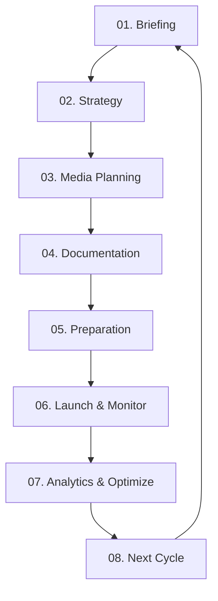

# 🔄 Процессы рекламного агентства

> **8 ключевых процессов:** От брифинга до следующего цикла

---

## 🎯 Обзор

Полный lifecycle рекламной кампании разбит на 8 последовательных процессов, каждый с четким RACI, артефактами и AI-автоматизацией.

**Всего процессов:** 8  
**Средняя длительность цикла:** 4-8 недель  
**AI ускорение:** 3x faster

---

## 📁 Процессы

| № | Процесс | Длительность | Ключевые роли | Статус |
|---|---------|--------------|---------------|--------|
| 1 | [01_Briefing](./01_Briefing/) | 3-5 дней | Client, Account, PM | ✅ 100% |
| 2 | [02_Strategy_Development](./02_Strategy_Development/) | 5-10 дней | Strategist, PM | ✅ 100% |
| 3 | [03_Media_Planning](./03_Media_Planning/) | 3-7 дней | Specialist, Strategist | ✅ 100% |
| 4 | [04_Documentation](./04_Documentation/) | 2-4 дня | PM, Specialist | ✅ 100% |
| 5 | [05_Campaign_Preparation](./05_Campaign_Preparation/) | 3-5 дней | Specialist, Creative | ✅ 100% |
| 6 | [06_Launch_Monitoring](./06_Launch_Monitoring/) | Ongoing | Specialist, Analyst | ✅ 100% |
| 7 | [07_Analytics_Optimization](./07_Analytics_Optimization/) | Ongoing | Analyst, Specialist | ✅ 100% |
| 8 | [08_Next_Cycle_Planning](./08_Next_Cycle_Planning/) | 2-3 дня | PM, Strategist | ✅ 100% |

---

## 🔄 Campaign Lifecycle



---

## 📊 Структура процесса

Каждый процесс документирован по единому стандарту:

```
[Process_Name]/
  ├── README.md                  # Обзор (вы здесь)
  ├── Overview.md                # Детальное описание
  ├── Process_Steps.md           # Пошаговая инструкция
  ├── Roles_Responsibilities.md  # RACI матрица
  ├── Data_IO.md                 # Входы и выходы
  └── Test_Scenario.md           # Тестовые сценарии
```

---

## 🔗 Связанные документы

- [`_LIFECYCLE_OVERVIEW.md`](./_LIFECYCLE_OVERVIEW.md) - Полный обзор lifecycle
- [Роли](../01_ROLES/) - Кто выполняет процессы
- [Артефакты](../02_ARTIFACTS/) - Что создается в процессах
- [AI Ассистенты](../06_AI_ASSISTANTS/) - AI помощь в процессах

---

## 💡 Best Practices

- 💡 **Следуйте последовательности:** Каждый процесс зависит от предыдущего
- 💡 **Используйте шаблоны:** Стандартизация ускоряет работу
- 💡 **Leverage AI:** Автоматизация рутины
- ⚠️ **Human-in-the-loop:** Критичные решения требуют человека

---

**Версия:** 1.0  
**Последнее обновление:** 24 октября 2025  
**Статус:** ✅ Полная документация

