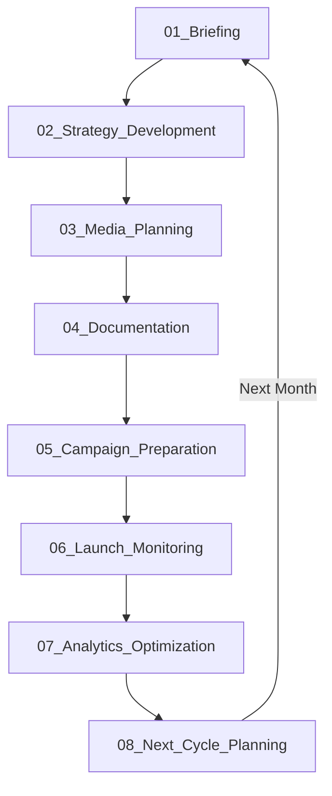

# 🔄 Campaign Lifecycle - Жизненный цикл рекламной кампании

**Дата:** 2025-10-23  
**Версия:** 2.0 (переработано под campaign lifecycle)

---

## 🎯 ФОКУС: ЖИЗНЕННЫЙ ЦИКЛ КАМПАНИИ

Это **НЕ процессы агентства** (pre-sale, onboarding), а процессы **рекламной кампании** от брифа до следующего цикла.

---

## 📋 8 ЭТАПОВ ЖИЗНЕННОГО ЦИКЛА



---

## 1️⃣ BRIEFING (Брифование)

**Что:** Детальный сбор требований для кампании

**Суть процесса:**
- Каждая роль определяет СВОИ требования к данным брифа
- User Story с большим кейсом (застройщик: несколько ЖК, городов, объектов)
- Структура брифа формируется из потребностей всех ролей
- Группировка: клиент → объекты продвижения → задачи по инструментам

**Участники:** Account, Strategist, Specialist, Analyst, Creative, PM

**Входы:** Запрос клиента  
**Выходы:** [Brief](../02_ARTIFACTS/Brief/) - детально структурированный

**Длительность:** 2-5 дней

**Пример кейса:**
```yaml
Клиент: Девелопер "СтройГрупп"

Объекты продвижения:
  ЖК "Солнечный" (Москва):
    - Квартиры: 1-3к, 45-95м², 8-15М₽
    - Паркинги: 1.5-2М₽
    - Бизнес-площади: 50-200м²
    
  ЖК "Морской" (СПб):
    - Квартиры: 1-2к, 40-70м², 6-10М₽
    - Паркинги: 1-1.5М₽
    
  ЖК "Лесной" (Казань):
    - Квартиры: 1-2к, 45-65м², 4-7М₽

Задачи:
  - Контекстная реклама (Яндекс, Google)
  - Медийная реклама (Programmatic)
  - Стратегия позиционирования
  - SEO продвижение сайтов
  - Ретейл медиа (Яндекс Недвижимость)
  - Инфлюенс маркетинг
  - SMM (VK, Telegram)
  
Бюджет: 15М₽/месяц
KPI: Лиды, CPL, Конверсия в сделку
```

→ [Детали: 01_Briefing/](./01_Briefing/)

---

## 2️⃣ STRATEGY DEVELOPMENT (Разработка стратегии)

**Что:** Разработка стратегии на основе брифа

**Суть процесса:**
- Анализ всех объектов продвижения
- Позиционирование для каждого ЖК
- Стратегия по каналам
- Распределение бюджета между объектами
- Customer Journey Map
- Креативная концепция

**Участники:** Strategist (lead), Specialist (консультация), Analyst (данные)

**Входы:** [Brief](../02_ARTIFACTS/Brief/)  
**Выходы:** [Strategy_Document](../02_ARTIFACTS/Strategy_Document/)

**Длительность:** 5-10 дней

**Пример решения:**
```yaml
Позиционирование:
  "Солнечный" (Москва): Premium, центр, инфраструктура
  "Морской" (СПб): Comfort, вид на залив, природа
  "Лесной" (Казань): Эконом+, экология, доступность

Channel Strategy:
  Москва (8М₽/мес):
    - Контекст: 3М₽ (высокая конкуренция)
    - Programmatic: 2.5М₽ (охват)
    - Ретейл медиа: 1.5М₽
    - SMM: 1М₽
    
  СПб (4М₽/мес):
    - Контекст: 2М₽
    - Programmatic: 1М₽
    - SMM: 1М₽
    
  Казань (3М₽/мес):
    - Контекст: 1.5М₽
    - Таргет (VK): 1М₽
    - SMM: 0.5М₽
```

→ [Детали: 02_Strategy_Development/](./02_Strategy_Development/)

---

## 3️⃣ MEDIA PLANNING (Медиапланирование)

**Что:** Детальное планирование размещений

**Суть процесса:**
- **Специалисты по категориям площадок** подключаются
- Контактируют с площадками → получают бенчмарки по стоимости
- Планируют объемы размещения

**Структура медиаплана:**
```
1 строка = 1 площадка + 1 формат + 1 бренд (ЖК)

Пример строки:
- Площадка: Яндекс Директ
- Формат: Поиск по ключам "квартиры москва"
- Бренд: ЖК "Солнечный"
- Параметры формата: CPC, текстово-графические
- Емкость: 50k показов/день
- Аудитория: Москва, 25-45 лет, поиск квартир
- Стоимость: CPC 80₽, бюджет 100k₽
- Ценообразование: Аукцион, ручные ставки
```

**Процесс согласования:**
- Построчно с ответственным специалистом
- Корректировки стоимости, формата, объемов
- Итерации до утверждения

**Участники:** Specialist по каждой категории (Контекст, Programmatic, Target, SMM), Account (согласование), Client (approve)

**Входы:** [Strategy_Document](../02_ARTIFACTS/Strategy_Document/)  
**Выходы:** [Media_Plan](../02_ARTIFACTS/Media_Plan/) - детальная таблица

**Длительность:** 5-7 дней

→ [Детали: 03_Media_Planning/](./03_Media_Planning/)

---

## 4️⃣ DOCUMENTATION (Оформление документов)

**Что:** Медиаплан → Юридические и финансовые документы

**Суть процесса:**
- Медиаплан превращается в **Заказы**
- Заказы → Договоры с площадками
- Заказы → Счета для оплаты
- Заказы → Акты выполненных работ

**Структура:**
```
Медиаплан (строка):
  "Яндекс Директ, Поиск, ЖК Солнечный, 100k₽"

Превращается в:

Заказ №001:
  - Поставщик: Яндекс
  - Услуга: Контекстная реклама
  - Сумма: 100k₽
  - Объект: ЖК "Солнечный"
  - Период: Октябрь 2025
  
Документы:
  - Договор с Яндекс (если новый)
  - Счет на оплату 100k₽
  - ТЗ на размещение
  - Акт (после выполнения)
```

**Участники:** PM (координация), Finance (оплаты), Legal (договоры), Specialist (техническая часть)

**Входы:** [Media_Plan](../02_ARTIFACTS/Media_Plan/)  
**Выходы:** Заказы, Договоры, Счета, ТЗ

**Длительность:** 3-5 дней

→ [Детали: 04_Documentation/](./04_Documentation/)

---

## 5️⃣ CAMPAIGN PREPARATION (Подготовка к запуску)

**Что:** Подготовка креативов и настройка кампаний

**Суть процесса:**

**После:** Юридические и финансовые вопросы решены

**По каждой строке медиаплана:**
1. Технические требования площадки
2. Креативная концепция (из Strategy)
3. Производство креативов
4. Настройка кампании в кабинете
5. QA проверка

**Пример:**
```yaml
Строка медиаплана:
  "VK Реклама, Карусель, ЖК Морской СПб, 150k₽"

Подготовка:
  1. Технические требования:
     - Формат: Карусель 10 карточек
     - Размер: 1080x1080px
     - Текст: до 220 символов/карточка
     
  2. Креативная концепция:
     - "Квартира с видом на залив"
     - УТП: вид, природа, тишина
     
  3. Производство:
     - 10 изображений квартир с видами
     - Копирайт для каждой карточки
     - CTA: "Записаться на просмотр"
     
  4. Настройка в VK:
     - Создание кампании
     - Загрузка креативов
     - Таргетинг: СПб, 28-45, интерес недвижимость
     - Ставка: 45₽ за клик
     - Бюджет: 150k₽
     - UTM метки
     - Pixel установлен
     
  5. QA:
     - Проверка отображения
     - Проверка ссылок
     - Проверка tracking
```

**Участники:** Creative (креативы), Specialist (настройка), Analyst (tracking), PM (координация)

**Входы:** [Media_Plan](../02_ARTIFACTS/Media_Plan/), [Strategy_Document](../02_ARTIFACTS/Strategy_Document/), [Technical_Specification](../02_ARTIFACTS/Technical_Specification/)

**Выходы:** Готовые кампании в кабинетах (не запущены)

**Длительность:** 7-14 дней

→ [Детали: 05_Campaign_Preparation/](./05_Campaign_Preparation/)

---

## 6️⃣ LAUNCH & MONITORING (Запуск и мониторинг)

**Что:** Запуск кампаний и сбор результатов

**Суть процесса:**

**Запуск:**
- Финальное approve от Client
- Одновременный запуск всех кампаний
- Уведомления stakeholders

**Мониторинг:**
- **Коннекторы к кабинетам** (API)
- **Коннекторы к системам аналитики** (GA4, Metrica)
- Сбор данных real-time
- Автоматические дашборды

**Данные собираются:**
```yaml
Из рекламных кабинетов:
  - Показы, Клики, CTR
  - Расход, CPC/CPM
  - Охват, Частота
  
Из аналитики:
  - Визиты на сайт
  - Поведение (глубина, время)
  - Лиды (заявки, звонки)
  - Конверсии
  
Объединение:
  - CPL (Cost Per Lead)
  - CPA (Cost Per Action)
  - ROMI
  - По объектам (ЖК)
  - По каналам
  - По городам
```

**Формирование отчета:**
- Таблицы (план vs факт)
- Графики (динамика)
- Выводы (AI анализ)

**Участники:** Specialist (мониторинг), Analyst (данные), Account (коммуникация с клиентом)

**Входы:** Запущенные кампании  
**Выходы:** [Campaign_Report](../02_ARTIFACTS/Campaign_Report/)

**Длительность:** Непрерывно (весь период кампании)

→ [Детали: 06_Launch_Monitoring/](./06_Launch_Monitoring/)

---

## 7️⃣ ANALYTICS & OPTIMIZATION (Аналитика и оптимизация)

**Что:** Глубокая аналитика и перераспределение бюджетов

**Суть процесса:**

**Множество инструментов аналитики:**

1. **Эконометрика** - предикт выполнения плана
   ```
   Текущие данные (15 дней) → Модель → Прогноз на месяц
   
   Прогноз: ЖК "Солнечный"
     - План: 200 лидов
     - Факт текущий темп: 80 лидов за 15 дней
     - Прогноз: 160 лидов к концу месяца
     - Отклонение: -20%
     - Рекомендация: Увеличить бюджет на 25%
   ```

2. **Атрибуционные данные** - вклад каждого канала
   ```
   Multi-touch Attribution:
   
   Лид №125 прошел путь:
     1. VK Ads (first touch) - 20% вклад
     2. Яндекс Директ (middle) - 30% вклад
     3. Programmatic (middle) - 20% вклад
     4. Прямой заход (last touch) - 30% вклад
   
   Реальный CPL с учетом атрибуции:
     VK: 1200₽ → 900₽ (недооценен)
     Директ: 1500₽ → 1800₽ (переоценен)
   ```

3. **Removal Effect** - что будет если убрать канал
   ```
   Симуляция: убираем VK Ads
   
   Результат:
     - VK давал 40 лидов/месяц
     - Если убрать: -40 лидов (прямой эффект)
     - НО: -15 лидов дополнительно (косвенный)
     - Итого: -55 лидов (-27.5% от плана)
     
   Вывод: VK критичен, нельзя убирать
   ```

4. **Сценарное планирование**
   ```
   Сценарий 1: +30% бюджет на Programmatic
     - Ожидаемо: +25 лидов
     - CPL: 1600₽
     - ROMI: 2.8x
     
   Сценарий 2: +20% на Директ, -20% на VK
     - Ожидаемо: +10 лидов
     - Но: снижение охвата (-15%)
     
   Рекомендация: Сценарий 1
   ```

**Участники:** Analyst (lead), Strategist (интерпретация), Specialist (реализация изменений)

**Входы:** [Campaign_Report](../02_ARTIFACTS/Campaign_Report/), Historical data

**Выходы:** Optimization recommendations, Updated [Media_Plan](../02_ARTIFACTS/Media_Plan/)

**Длительность:** Еженедельно + Финальный анализ

→ [Детали: 07_Analytics_Optimization/](./07_Analytics_Optimization/)

---

## 8️⃣ NEXT CYCLE PLANNING (Планирование следующего цикла)

**Что:** Подготовка вводных для следующего месяца

**Суть процесса:**

**На основе выводов текущей кампании:**
- Что работало хорошо
- Что не сработало
- Новые insights об аудитории
- Скорректированные KPI
- Оптимизированное распределение бюджета

**Обновленный бриф для следующего цикла:**
```yaml
Бриф на Ноябрь (с учетом Октябрьских данных):

Изменения в целях:
  ЖК "Солнечный":
    - Было: 200 лидов, CPL 1500₽
    - Факт: 180 лидов, CPL 1650₽
    - На след месяц: 220 лидов, CPL 1400₽ (оптимизация)
    
Изменения в бюджете:
  Москва:
    Programmatic: 2.5М → 3М (+20% по removal effect)
    Контекст: 3М → 2.8М (-7% по attribution data)
    
Новые insights:
  - Квартиры >80м² конвертят лучше (+30%)
  - Паркинги отдельно не продвигать (низкий спрос)
  - Бизнес-площади: отдельная стратегия нужна
  
Новые задачи:
  - Протестировать YouTube (видео-туры)
  - Запустить Telegram Ads (новый канал)
  - Убрать неэффективные площадки
```

**Процесс:**
1. Финальный отчет за месяц
2. Встреча команды (ретроспектива)
3. Обновление Strategy Document
4. Обновление Brief для следующего цикла
5. Передача на повтор цикла

**Участники:** Вся команда (Account, Strategist, Specialist, Analyst, PM)

**Входы:** [Campaign_Report](../02_ARTIFACTS/Campaign_Report/), Analytics insights

**Выходы:** Updated [Brief](../02_ARTIFACTS/Brief/), Learnings document

**Длительность:** 2-3 дня

**Следующий шаг:** → Возврат к **01_Briefing** (новый цикл)

→ [Детали: 08_Next_Cycle_Planning/](./08_Next_Cycle_Planning/)

---

## 🔁 КОММУНИКАЦИЯ КОМАНД

**Форматы коммуникации на каждом этапе:**

### Daily Standups (во время активной кампании)
- Specialist reports на изменения
- Issues escalation
- Quick decisions

### Weekly Reviews
- Performance review
- Optimization decisions
- Next week planning

### Sprint Planning (каждый цикл)
- Что делаем в следующем месяце
- Распределение задач
- Deadlines

### Retrospectives (конец цикла)
- Что работало
- Что улучшить
- Learnings

### Ad-hoc коммуникация
- Slack/Telegram для быстрых вопросов
- Jira для задач и tracking
- Google Sheets как Command Center

---

## 📊 МЕТРИКИ LIFECYCLE

### По времени:
```yaml
Полный цикл: 30-45 дней
  - Briefing: 2-5 дней
  - Strategy: 5-10 дней
  - Media Planning: 5-7 дней
  - Documentation: 3-5 дней
  - Preparation: 7-14 дней
  - Launch: 1 день
  - Monitoring: 20-30 дней (непрерывно)
  - Analytics: еженедельно
  - Next Cycle: 2-3 дня
```

### По качеству:
```yaml
Brief completeness: >95%
Strategy approval: first time >80%
Media Plan accuracy: ±10% от факта
Campaign launch: успех >98%
KPI achievement: >75% кампаний
```

---

**Версия:** 2.0  
**Дата:** 2025-10-23  
**Статус:** ✅ Переработано под campaign lifecycle

→ [Детали каждого процесса](./01_Briefing/)


