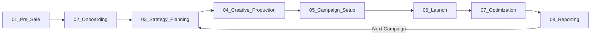

# 🔄 Campaign Lifecycle - Обзор жизненного цикла

**Дата:** 2025-10-23  
**Версия:** 1.0

---

## 📋 ЖИЗНЕННЫЙ ЦИКЛ РЕКЛАМНОЙ КАМПАНИИ

### 8 основных этапов:



---

## 1️⃣ PRE-SALE (Лид → КП)

**Цель:** Квалифицировать лида и подготовить коммерческое предложение

**Триггер:** Входящий лид  
**Длительность:** 3-7 дней  
**Ключевая роль:** Account Manager + Strategist

**Основные процессы:**
- Lead Qualification (Квалификация лида)
- Quick Check (Быстрая проверка)
- Commercial Proposal Preparation (Подготовка КП)
- Proposal Presentation (Презентация КП)
- Negotiations (Переговоры)

**Артефакты:**
- IN: Lead data, Initial request
- OUT: [Commercial_Proposal](../02_ARTIFACTS/Commercial_Proposal/)

**Метрики:**
- Lead-to-Proposal conversion: 40-60%
- Proposal-to-Deal conversion: 25-35%
- Time to Proposal: <5 дней

→ [Детали: 01_Pre_Sale/](./01_Pre_Sale/)

---

## 2️⃣ ONBOARDING (Подписание → Kickoff)

**Цель:** Онбордить клиента в систему и запустить проект

**Триггер:** Подписание договора  
**Длительность:** 2-3 дня  
**Ключевая роль:** Account Manager + PM

**Основные процессы:**
- Contract Signing (Подписание)
- Client Portal Setup (Настройка портала)
- Team Assignment (Формирование команды)
- Kickoff Meeting (Стартовая встреча)
- Brief Collection (Сбор брифа)

**Артефакты:**
- IN: Signed contract
- OUT: [Brief](../02_ARTIFACTS/Brief/), [Project_Passport](../02_ARTIFACTS/Project_Passport/)

**Метрики:**
- Time to Kickoff: <3 дня
- Brief completeness: >90%
- Team satisfaction: 4+/5

→ [Детали: 02_Onboarding/](./02_Onboarding/)

---

## 3️⃣ STRATEGY & PLANNING (Бриф → Стратегия → Медиаплан)

**Цель:** Разработать стратегию кампании и медиаплан

**Триггер:** Заполненный бриф  
**Длительность:** 5-10 дней  
**Ключевая роль:** Strategist + Specialist

**Основные процессы:**
- Brief Analysis (Анализ брифа)
- Market Research (Исследование рынка)
- Strategy Development (Разработка стратегии)
- Strategy Presentation (Презентация стратегии)
- Media Planning (Медиапланирование)
- Budget Allocation (Распределение бюджета)

**Артефакты:**
- IN: [Brief](../02_ARTIFACTS/Brief/)
- OUT: [Strategy_Document](../02_ARTIFACTS/Strategy_Document/), [Media_Plan](../02_ARTIFACTS/Media_Plan/)

**Метрики:**
- Strategy approval rate: >80%
- Time to Strategy: <7 дней
- Client satisfaction: 4.5+/5

→ [Детали: 03_Strategy_Planning/](./03_Strategy_Planning/)

---

## 4️⃣ CREATIVE PRODUCTION (Концепция → Креативы)

**Цель:** Создать креативные материалы для кампании

**Триггер:** Утвержденная стратегия  
**Длительность:** 7-14 дней  
**Ключевая роль:** Creative Director + Designer

**Основные процессы:**
- Creative Briefing (Креативный бриф)
- Concept Development (Разработка концепции)
- Design Production (Производство дизайна)
- Copywriting (Копирайтинг)
- Format Adaptations (Адаптации форматов)
- Client Approval (Согласование с клиентом)

**Артефакты:**
- IN: [Strategy_Document](../02_ARTIFACTS/Strategy_Document/), Creative Brief
- OUT: Креативы (все форматы)

**Метрики:**
- Creative approval rate: >75%
- Iterations: <3
- Time to Creative: <10 дней

→ [Детали: 04_Creative_Production/](./04_Creative_Production/)

---

## 5️⃣ CAMPAIGN SETUP (Настройка кампаний)

**Цель:** Настроить рекламные кампании во всех кабинетах

**Триггер:** Утвержденные креативы  
**Длительность:** 3-5 дней  
**Ключевая роль:** Specialist + Analyst

**Основные процессы:**
- Technical Specification (Техническое задание)
- Tracking Setup (Настройка трекинга)
- Campaign Configuration (Настройка кампаний)
- Creative Upload (Загрузка креативов)
- Targeting Setup (Настройка таргетинга)
- Budget & Bidding (Бюджет и ставки)
- QA Testing (Тестирование)

**Артефакты:**
- IN: [Media_Plan](../02_ARTIFACTS/Media_Plan/), Креативы
- OUT: [Technical_Specification](../02_ARTIFACTS/Technical_Specification/), Configured campaigns

**Метрики:**
- Setup errors: <5%
- QA pass rate: >95%
- Time to Setup: <5 дней

→ [Детали: 05_Campaign_Setup/](./05_Campaign_Setup/)

---

## 6️⃣ LAUNCH (Запуск кампании)

**Цель:** Запустить кампанию и провести начальный мониторинг

**Триггер:** QA passed  
**Длительность:** 1 день (мониторинг 3 дня)  
**Ключевая роль:** PM + Specialist

**Основные процессы:**
- Final Client Approval (Финальное согласование)
- Campaign Launch (Запуск)
- Initial Monitoring (Начальный мониторинг)
- Issue Resolution (Решение проблем)
- Stakeholder Notification (Уведомления)

**Артефакты:**
- IN: Configured campaigns
- OUT: Launched campaigns, Launch report

**Метрики:**
- Launch success rate: >98%
- Critical issues: 0
- Time to resolve issues: <2ч

→ [Детали: 06_Launch/](./06_Launch/)

---

## 7️⃣ OPTIMIZATION (Мониторинг + Оптимизация)

**Цель:** Мониторить performance и оптимизировать кампании

**Триггер:** Кампания запущена  
**Длительность:** Непрерывно  
**Ключевая роль:** Specialist + Analyst

**Основные процессы:**
- Daily Monitoring (Ежедневный мониторинг)
- Performance Analysis (Анализ performance)
- Anomaly Detection (Выявление аномалий)
- Optimization Actions (Действия по оптимизации)
- A/B Testing (A/B тестирование)
- Budget Reallocation (Перераспределение бюджета)

**Артефакты:**
- IN: Campaign data
- OUT: Optimization reports, Updated campaigns

**Метрики:**
- ROMI improvement: +15-30%
- Response time: <4ч
- Optimization frequency: 2-3/неделю

→ [Детали: 07_Optimization/](./07_Optimization/)

---

## 8️⃣ REPORTING (Отчетность)

**Цель:** Предоставить отчеты клиенту и собрать insights

**Триггер:** Weekly/Monthly schedule  
**Длительность:** Weekly (1ч), Monthly (3ч)  
**Ключевая роль:** Account Manager + Analyst

**Основные процессы:**
- Data Collection (Сбор данных)
- Performance Analysis (Анализ результатов)
- Insights Generation (Генерация инсайтов)
- Report Creation (Создание отчета)
- Client Presentation (Презентация клиенту)
- Feedback Collection (Сбор feedback)

**Артефакты:**
- IN: Campaign data, Analytics
- OUT: [Campaign_Report](../02_ARTIFACTS/Campaign_Report/)

**Метрики:**
- Report delivery: On-time >95%
- Client satisfaction: 4.5+/5
- Action items adoption: >70%

→ [Детали: 08_Reporting/](./08_Reporting/)

---

## 📊 СКВОЗНЫЕ МЕТРИКИ LIFECYCLE

### Time Metrics:
```yaml
Pre-Sale to Launch: 20-35 дней
  - Pre-Sale: 3-7 дней
  - Onboarding: 2-3 дня
  - Strategy: 5-10 дней
  - Creative: 7-14 дней
  - Setup: 3-5 дней
  - Launch: 1 день
```

### Quality Metrics:
```yaml
First Time Right Rate: >80%
Client Satisfaction: 4.5+/5
Error Rate: <5%
On-Time Delivery: >90%
```

### Business Metrics:
```yaml
Campaign Success Rate: >75%
Client Retention: >85%
Upsell Rate: >30%
NPS Score: 50+
```

---

## 🤖 AI АВТОМАТИЗАЦИЯ ПО LIFECYCLE

| Lifecycle | AI Automation | Time Saved |
|-----------|---------------|------------|
| Pre-Sale | КП генерация, Расчеты | 80% (6ч → 1ч) |
| Onboarding | Brief заполнение | 50% (2ч → 1ч) |
| Strategy | Research, Draft strategy | 70% (15ч → 4ч) |
| Creative | Adaptations | 75% (15ч → 3ч) |
| Setup | Templates, Validation | 60% (5ч → 2ч) |
| Launch | Monitoring | 50% (4ч → 2ч) |
| Optimization | Insights, Recommendations | 70% (10ч → 3ч) |
| Reporting | Auto reports | 90% (3ч → 30мин) |

**ИТОГО:** 60-70% экономии времени на lifecycle

---

## 🔗 СВЯЗИ

- [01_ROLES/](../01_ROLES/) - Кто участвует в процессах
- [02_ARTIFACTS/](../02_ARTIFACTS/) - Что создается
- [03_TOOLS/](../03_TOOLS/) - Инструменты для процессов
- [06_AI_ASSISTANTS/](../06_AI_ASSISTANTS/) - AI автоматизация

---

**Версия:** 1.0  
**Дата:** 2025-10-23  
**Статус:** ✅ Актуально

→ [Вернуться к главному README](../README.md)


