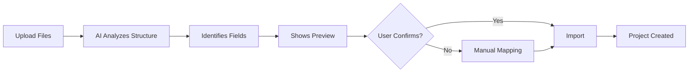
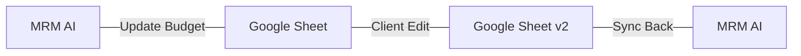
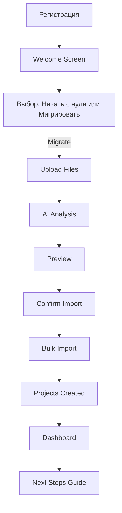

# 🔄 Migration Assistant - Быстрый старт в MRM AI

**Версия:** 1.0  
**Статус:** ✅ Спецификация готова  
**Приоритет:** 🔴 CRITICAL (MVP Sprint 1-2)

---

## 🎯 Назначение

Migration Assistant - это ключевой инструмент для **максимально быстрого онбординга** агентства в MRM AI систему.

### Проблема
Агентства хранят проекты в:
- 50+ разных Excel/Google Sheets файлах
- Email переписках
- Jira/YouGile задачах
- Рекламных кабинетах (Yandex, VK, и т.д.)

**Боль:** Миграция на новую систему занимает недели-месяцы → агентства не хотят переходить

### Решение
> **"Отдаешь файлы → AI мигрирует за 1-2 дня → Можно работать"**

**Ценность:**
- ⚡ Быстрый старт: 1-2 дня вместо недель
- 🤖 AI-автоматизация: парсинг любых структур
- 📊 Сохранение истории: все проекты с контекстом
- 🔄 Bidirectional sync: Excel ↔ MRM AI

---

## 📦 Компоненты

### 1. Excel/Sheets Parser + AI Field Detection

**Input:**
- Excel файлы (.xlsx, .xls, .csv)
- Google Sheets (ссылка)
- ZIP архивы с медиапланами

**Process:**


**AI Field Detection:**
```python
# AI определяет поля автоматически
{
  "channels": "Column B (contains: Яндекс, VK, Таргет)",
  "budget": "Column D (contains numbers with rubles)",
  "period": "Column A (contains dates)",
  "kpi": "Columns E-H (CPA, CTR, Leads)",
  "geo": "Column C (contains cities)"
}
```

**Output:**
- Спарсенный медиаплан (JSON)
- Маппинг полей (сохраняется для будущих импортов)
- Валидация errors/warnings

---

### 2. Template Learning

**Концепция:** Система запоминает структуры клиентов

```yaml
Client "Realweb":
  Template 1: "Медиаплан стандартный"
    Структура: 
      - Лист 1: Каналы и бюджеты
      - Лист 2: Таргетинги
      - Лист 3: Креативы
    Маппинг:
      Канал: Column A
      Формат: Column B
      Бюджет: Column E
      ...

  Template 2: "Медиаплан для клиента X"
    Структура: [другая]

Когда импортируем следующий файл:
  1. AI ищет похожую структуру в Templates
  2. Если найдена → использует готовый маппинг
  3. Если нет → AI определяет поля заново
  4. Сохраняет новый template
```

**Benefit:** 
- 1-й импорт: 5 минут на маппинг
- 2-й импорт: автоматически (0 минут)
- N-й импорт: автоматически

---

### 3. Project Structure Auto-Creation

**После импорта медиаплана создается:**

```yaml
Project:
  name: "Клиент X - Кампания Y"
  status: "Active"
  timeline:
    start: [из медиаплана]
    end: [из медиаплана]
  
  Artifacts:
    - Brief (если есть в файлах)
    - Media Plan (imported)
    - Strategy (stub - заполнить позже)
    - Reports (будут создаваться автоматически)
  
  Team:
    - Account Manager: [AI определяет из истории или спрашивает]
    - Project Manager: [AI определяет]
    - Specialists: [AI назначает по каналам]
  
  Tasks:
    - Setup (RACI: PM - R, Account - A)
    - Launch (RACI: Specialist - R, PM - A)
    - Monitoring (RACI: Specialist - R)
    - Reporting (RACI: Specialist - R, Analyst - C)
    - Optimization (RACI: Specialist - R, PM - C)
  
  Budget:
    total: [из медиаплана]
    by_channel: [из медиаплана]
    spent: 0 (будет обновляться из интеграций)
  
  KPIs:
    [из медиаплана или default по каналам]
```

---

### 4. Historical Data Migration

**Источники:**
```yaml
1. Рекламные кабинеты:
   - Yandex Direct: campaigns, stats (last 6 months)
   - VK Ads: campaigns, stats
   - MyTarget: campaigns, stats
   
2. Аналитика:
   - Yandex Metrika: goals, conversions
   - AmoCRM: leads, deals
   
3. Отчеты:
   - Excel отчеты (парсинг)
   - Email отчеты (парсинг из архива)
```

**Process:**
```python
def migrate_historical_data(project, sources):
    """
    Миграция исторических данных для baseline
    """
    # 1. Определяем период для миграции
    lookback_period = 6  # months
    
    # 2. Собираем данные из кабинетов
    for channel in project.channels:
        if channel.type == 'yandex_direct':
            campaigns = yandex_api.get_campaigns(
                date_from=lookback_period_ago,
                date_to=today
            )
            stats = yandex_api.get_stats(campaigns)
            save_to_data_lake(stats)
    
    # 3. Строим baseline для сравнения
    baseline = calculate_baseline(historical_stats)
    project.baseline = baseline
    
    return {
        'campaigns_imported': len(campaigns),
        'data_points': len(stats),
        'baseline': baseline
    }
```

**Baseline:**
```yaml
Baseline (последние 6 месяцев):
  Avg_CPM: 250 руб
  Avg_CPC: 15 руб
  Avg_CTR: 1.5%
  Avg_CR: 2.3%
  Avg_CPA: 650 руб
  
  By_Channel:
    Yandex_Direct:
      CPM: 180
      CPC: 12
      ...
    VK_Ads:
      CPM: 320
      CPC: 18
      ...
```

**Использование baseline:**
- Сравнение текущих кампаний с историческими
- Alerts при отклонении >20% от baseline
- Benchmarks для новых проектов

---

### 5. Bulk Import

**Сценарий:** Импорт 50+ проектов за раз

**UI:**
```yaml
Step 1: Upload Files
  - Drag & Drop зона
  - Или выбор папки (all *.xlsx)
  - Или ZIP archive

Step 2: AI Analysis
  - Progress bar
  - AI анализирует каждый файл
  - Группирует по клиентам (если может)
  
Step 3: Preview & Mapping
  - Список всех файлов
  - Для каждого: detected fields
  - Можно скорректировать маппинг
  - Применить mapping к группе файлов

Step 4: Import
  - Параллельный импорт (5 файлов одновременно)
  - Progress tracking
  - Errors log (что не удалось)
  
Step 5: Review
  - Сколько проектов создано
  - Warnings (что нужно проверить вручную)
  - Next steps (что делать дальше)
```

**Performance:**
```yaml
Targets:
  - 1 файл: <30 секунд
  - 50 файлов: <30 минут
  - Success rate: >95%
```

---

### 6. Bidirectional Sync

**Концепция:** Изменения синхронизируются в обе стороны



**Зачем:**
- Клиенты привыкли к Excel/Sheets (не хотят учить новый интерфейс)
- Клиент может редактировать медиаплан в Sheets
- MRM AI → обновляется автоматически

**Реализация:**
```yaml
Option 1: Google Sheets API + Webhooks
  - MRM AI следит за изменениями в Sheets (webhook)
  - Изменение в Sheets → trigger sync → обновление MRM AI
  - Изменение в MRM AI → API call → обновление Sheets

Option 2: Polling (fallback)
  - Каждые 5 минут проверяем изменения
  - Если changed → sync

Conflict Resolution:
  - Last write wins (с warning)
  - Или: показываем diff, user resolves manually
```

---

## 🛠️ Технический стек

### Backend
```typescript
// NestJS Module
@Module({
  imports: [
    ExcelParserModule,
    AIFieldDetectionModule,
    ProjectCreatorModule,
    HistoricalDataModule,
    GoogleSheetsModule
  ],
  controllers: [MigrationController],
  providers: [MigrationService]
})
export class MigrationAssistantModule {}
```

### AI Models
```yaml
OpenAI GPT-4:
  - Field detection
  - Template matching
  - Data validation
  - Error explanation

Prompt Template:
  "Analyze this Excel structure and identify fields:
   [Excel structure]
   
   Possible fields:
   - Channel (Яндекс, VK, Таргет)
   - Budget (numbers with currency)
   - Period (dates)
   - KPI (CTR, CPA, Leads)
   - Geo (cities)
   
   Return JSON with mapping."
```

### Libraries
```yaml
Excel Parsing:
  - exceljs (Node.js)
  - XLSX (for .xls)
  - csv-parser (for .csv)

Google Sheets:
  - googleapis (Node.js)
  - OAuth 2.0 for auth

Database:
  - PostgreSQL (projects, mappings)
  - Redis (caching)
  - ClickHouse (historical data)

Queue:
  - Bull (Redis-based)
  - For background jobs (bulk import)
```

---

## 📊 Database Schema

### Tables

#### migration_templates
```sql
CREATE TABLE migration_templates (
  id UUID PRIMARY KEY,
  client_id UUID REFERENCES clients(id),
  name VARCHAR(255),
  description TEXT,
  structure JSONB,  -- Структура файла
  mapping JSONB,    -- Маппинг полей
  created_at TIMESTAMP,
  usage_count INT DEFAULT 0,
  last_used_at TIMESTAMP
);
```

#### import_jobs
```sql
CREATE TABLE import_jobs (
  id UUID PRIMARY KEY,
  user_id UUID REFERENCES users(id),
  status VARCHAR(50), -- pending, processing, completed, failed
  files JSONB,        -- Список файлов
  progress INT DEFAULT 0,
  total_files INT,
  imported_projects INT DEFAULT 0,
  errors JSONB,       -- Errors log
  started_at TIMESTAMP,
  completed_at TIMESTAMP
);
```

#### file_sync_config
```sql
CREATE TABLE file_sync_config (
  id UUID PRIMARY KEY,
  project_id UUID REFERENCES projects(id),
  source_type VARCHAR(50), -- google_sheets, excel_file
  source_url TEXT,
  mapping JSONB,
  sync_enabled BOOLEAN DEFAULT true,
  sync_frequency VARCHAR(50), -- real-time, hourly, daily
  last_synced_at TIMESTAMP
);
```

---

## 🎯 User Flow

### Онбординг нового агентства



### Next Steps после миграции

```yaml
1. Review Projects (10 мин):
   - Проверить что все проекты корректны
   - Скорректировать team assignments
   - Установить KPI (если не определились автоматически)

2. Connect Integrations (15 мин):
   - Yandex Direct API
   - VK Ads API
   - Yandex Metrika
   
3. Setup Notifications (5 мин):
   - Email, Telegram
   - Alerts preferences
   
4. Invite Team (10 мин):
   - Добавить членов команды
   - Назначить роли
   
5. First Report (1 мин):
   - Сгенерировать первый отчет
   - Увидеть магию automation
   
Total: 40 минут → Ready to work!
```

---

## 🧪 Testing Strategy

### Unit Tests
```typescript
describe('ExcelParser', () => {
  it('should parse standard media plan structure', async () => {
    const file = load_test_file('mediaplan_standard.xlsx');
    const result = await excelParser.parse(file);
    
    expect(result.channels).toHaveLength(5);
    expect(result.budget_total).toBe(1000000);
  });
  
  it('should handle different date formats', async () => {
    // Test DD.MM.YYYY, MM/DD/YYYY, ISO formats
  });
  
  it('should detect currency (RUB, USD, EUR)', async () => {
    // ...
  });
});

describe('AIFieldDetection', () => {
  it('should identify budget column correctly', async () => {
    const structure = {
      columns: ['Канал', 'Формат', 'Период', 'Бюджет', 'CPM']
    };
    
    const detected = await aiFieldDetection.detect(structure);
    
    expect(detected.budget_column).toBe('D'); // Бюджет
  });
});
```

### Integration Tests
```typescript
describe('Full Import Flow', () => {
  it('should import 5 projects from Excel files', async () => {
    const files = ['project1.xlsx', ..., 'project5.xlsx'];
    
    const job = await migrationService.bulkImport(files);
    
    await waitForCompletion(job.id);
    
    const projects = await projectService.getAll();
    expect(projects).toHaveLength(5);
    
    // Проверяем что все поля заполнены корректно
    expect(projects[0].budget).toBeGreaterThan(0);
    expect(projects[0].channels).toHaveLength(3);
  });
});
```

### E2E Tests
```typescript
describe('User Onboarding E2E', () => {
  it('should complete onboarding in <5 minutes', async () => {
    await page.goto('/onboarding');
    await page.click('button[data-testid="migrate"]');
    
    // Upload files
    await page.setInputFiles('input[type="file"]', [
      'test-data/mediaplan1.xlsx',
      'test-data/mediaplan2.xlsx'
    ]);
    
    // Wait for AI analysis
    await page.waitForSelector('.preview-ready');
    
    // Confirm import
    await page.click('button[data-testid="confirm-import"]');
    
    // Wait for completion
    await page.waitForSelector('.import-completed');
    
    // Check dashboard
    const projectCount = await page.textContent('.projects-count');
    expect(projectCount).toBe('2');
  });
});
```

---

## 📈 Метрики успеха

### KPIs
```yaml
Speed:
  - Time to first project imported: <2 minutes
  - Time to 50 projects imported: <30 minutes
  - Full onboarding: <1 day

Accuracy:
  - Import success rate: >95%
  - Field detection accuracy: >90%
  - Template match rate: >80% (for repeat clients)

User Satisfaction:
  - NPS: >40
  - "Would recommend Migration Assistant": >80%
  - Support tickets related to import: <5%

Business:
  - Conversion (registration → active user): >60%
  - Time saved vs manual entry: 10-20 hours/project
  - Churn due to onboarding: <10%
```

### Tracking
```typescript
// Analytics events
tracker.event('migration_started', {
  files_count: files.length,
  user_id: user.id
});

tracker.event('migration_completed', {
  files_count: files.length,
  projects_created: projects.length,
  duration_seconds: duration,
  success_rate: success_rate,
  user_id: user.id
});

tracker.event('template_reused', {
  template_id: template.id,
  client_id: client.id
});
```

---

## 🚀 Roadmap

### Sprint 1 (Неделя 1-2)
- ✅ Excel Parser
- ✅ AI Field Detection
- ✅ Basic Import (1 file at a time)
- ✅ Preview & Validation UI

### Sprint 2 (Неделя 3-4)
- ✅ Template Learning
- ✅ Bulk Import
- ✅ Progress Tracking
- ✅ Error Handling

### Phase 2 (После MVP)
- ⏳ Historical Data Migration (рекламные кабинеты)
- ⏳ Bidirectional Sync (Google Sheets)
- ⏳ Advanced Template Matching (ML-based)
- ⏳ PDF parsing (брифы из PDF)

---

## 📚 Документация

### Для разработчиков
- [API Documentation](./API.md)
- [Architecture Diagrams](./ARCHITECTURE.md)
- [Database Schema](./DATABASE.md)

### Для пользователей
- [Quick Start Guide](./QUICK_START.md)
- [Import Best Practices](./BEST_PRACTICES.md)
- [Troubleshooting](./TROUBLESHOOTING.md)
- [FAQ](./FAQ.md)

---

**Статус:** ✅ Спецификация завершена  
**Next:** Разработка Sprint 1  
**Версия:** 1.0  
**Дата:** 23 октября 2025


