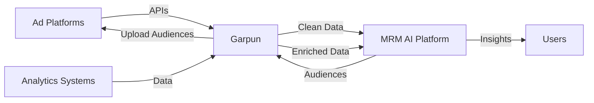

# Garpun Partnership Integration
## Интеграция с Garpun для автоматизации сбора данных

→ [Integrations Overview](../_README.md) | [Architecture](../../08_ARCHITECTURE/Overview.md)

**Partner:** [Garpun](https://garpun.com)  
**Website:** https://garpun.com/#listofconnectors  
**Type:** Data Integration Platform  
**Status:** ✅ Strategic Partner

---

## 🎯 Why Garpun?

**Проблема:**
- Нужны интеграции с 10+ рекламными кабинетами
- Разработка каждой интеграции = 2-4 недели
- Поддержка API (изменения, rate limits, auth)
- Total: 6+ месяцев разработки

**Решение: Garpun**
- ✅ **270+ компаний** уже используют
- ✅ **Готовые коннекторы** ко всем major платформам
- ✅ **Поддержка API** — их проблема, не наша
- ✅ **Time to market:** сократили с 6 месяцев до 2 недель

**Result:** Сфокусировались на **core value** (AI, analytics, UX), не на "plumbing"

---

## 📊 Garpun Capabilities

### Полный список возможностей Garpun (2025)

**🎯 7 основных категорий функций**

---

#### 1️⃣ Загрузка расходов в Yandex Metrika (6 источников)

```yaml
✅ Facebook Ads → Yandex Metrika
✅ Google Ads → Yandex Metrika
✅ MyTarget → Yandex Metrika
✅ VK Ads → Yandex Metrika
✅ Yandex Market → Yandex Metrika

Use case для MRM AI:
  - Cost data в Метрике
  - Unified ROI tracking
  - No manual cost uploads
  
Priority для MVP: P0 (критично для аналитики!)
```

---

#### 2️⃣ Выгрузка данных в Google BigQuery (20+ источников)

```yaml
Рекламные платформы:
  ✅ Яндекс Директ → BQ
  ✅ VK Реклама (новый кабинет) → BQ
  ✅ VK ads (старый кабинет) → BQ
  ✅ MyTarget → BQ
  ✅ TikTok → BQ
  ✅ Telegram Ads → BQ
  ✅ WildBerries → BQ
  ✅ Ozon Performance → BQ

Аналитика:
  ✅ Google Analytics → BQ
  ✅ Yandex AppMetrica → BQ
  ✅ TrackAd → BQ
  ✅ AppsFlyer → BQ

Маркетплейсы:
  ✅ Yandex Market → BQ
  ✅ WildBerries → BQ
  ✅ Google Merchant Centre → BQ

RTB/DSP:
  ✅ MTS RTB → BQ
  ✅ Roxot → BQ
  ✅ RTB House → BQ
  ✅ Gnezdo → BQ
  ✅ Weborama → BQ

Мобайл:
  ✅ Apple Search Ads → BQ
  ✅ AppsFlyer → BQ

CRM & Коммуникации:
  ✅ Битрикс24 → BQ
  ✅ Chat2desk → BQ
  ✅ Яндекс Аудитории → BQ

Другое:
  ✅ Google Spreadsheets → BQ
  ✅ Яндекс ПромоСтраницы

Use case для MRM AI:
  - Enterprise clients с BQ
  - Advanced analytics
  - Data warehouse integration
  
Priority для MVP: P1 (для крупных клиентов)
```

---

#### 3️⃣ Загрузка аудиторных списков (Multi-destination)

```yaml
Источники аудиторий:
  ✅ Calltouch
  ✅ AmoCRM
  ✅ Comagic
  ✅ CSV/Spreadsheet/XLS файлы
  ✅ Unisender

Направления загрузки:
  ✅ Яндекс Аудитории
  ✅ VK Реклама
  ✅ MyTarget
  ✅ Другие рекламные системы

Use case для MRM AI:
  - AI segmentation → Garpun → Ad platforms
  - Automated retargeting
  - Cross-platform audience sync
  
Priority для MVP: P1 (для автоматизации ретаргетинга)
```

---

#### 4️⃣ Работа с базами данных (3 типа БД)

```yaml
Импорт в БД:
  ✅ PostgreSQL  ⭐ Наша основная БД
  ✅ MySQL
  ✅ ClickHouse  ⭐ Для analytics

Экспорт из БД:
  ✅ PostgreSQL → любые системы
  ✅ MySQL → любые системы
  ✅ ClickHouse → любые системы

Специальные потоки:
  ✅ AppsFlyer → ClickHouse
  ✅ Yandex Direct → ClickHouse
  ✅ Yandex Metrika → ClickHouse

Use case для MRM AI:
  - Direct data ingestion в PostgreSQL
  - ClickHouse для fast analytics
  - ETL pipelines
  
Priority для MVP: P0 (основная интеграция!)
```

---

#### 5️⃣ Лиды (Real-time обработка)

```yaml
Получение лидов:
  ✅ VK Реклама (leads)
  ✅ Facebook Leads (real-time)
  ✅ AmoCRM (лиды и контакты)

Отправка лидов:
  ✅ Telegram (real-time уведомления)
  ✅ Email (real-time уведомления)
  ✅ AmoCRM (создание лидов)

Use case для MRM AI:
  - Lead tracking & attribution
  - Instant team notifications
  - Sales funnel automation
  
Priority для MVP: P1 (для отслеживания эффективности)
```

---

#### 6️⃣ Выгрузка и хранение данных

```yaml
Google Spreadsheet:
  ✅ Выгрузка в Google Sheets
  ✅ Упрощенная настройка через UI

S3 хранилища:
  ✅ Yandex.Cloud (S3)
  ✅ GCP (S3)
  ✅ S3 → S3 миграция

Другие форматы:
  ✅ CSV/JSON (упрощенные пресеты)
  ✅ XML
  ✅ Webhook

Use case для MRM AI:
  - Export отчетов в Google Sheets
  - Backup в S3
  - Integration с внешними системами
  
Priority для MVP: P0 (для экспорта данных клиентам!)
```

---

#### 7️⃣ Специальные функции

```yaml
Товарные фиды:
  ✅ Работа с товарными фидами
  ✅ Генерация фида для Яндекс.Недвижимости

Email Marketing:
  ✅ Mailchimp integration
  ✅ Unisender (загрузка контактов)

Потоки:
  ✅ Работа с потоками
  ✅ Webhook integration

Google Analytics 4:
  ✅ Загрузка расходов из Yandex Direct → GA4

Use case для MRM AI:
  - E-commerce clients (фиды)
  - Email campaigns
  - Custom workflows
  
Priority для MVP: P2 (по запросам клиентов)
```

---

### 1. Garpun Feeds (Core Product)
**Назначение:** Перекладка данных между системами

**Use case для MRM AI:**
```yaml
Scenario: Авто-сбор данных для отчетов
  
  Source Systems:
    - Яндекс Директ ✅
    - VK Ads ✅
    - myTarget ✅
    - Telegram Ads ✅
    - Google Ads ✅
    - Yandex Metrika ✅
    - Google Analytics 4 ✅
  
  → Garpun Feeds →
  
  Destination:
    - MRM AI Database (PostgreSQL) ✅
    - Google Sheets (для клиентов)
    - ClickHouse (для analytics) ✅
  
  Frequency: Daily (configurable)
  
  Value:
    - Auto data collection (80h/month saved)
    - No manual export/import
    - Real-time freshness
    - 45+ connectors ready to use!
```

---

### 2. Сквозная аналитика
**Назначение:** Учет степени участия каждого канала

**Use case для MRM AI:**
```yaml
Integration:
  - Garpun собирает данные из всех каналов
  - Garpun отправляет в единое хранилище
  - MRM AI применяет attribution models
  - MRM AI показывает unified view
  
Benefit:
  - Multi-touch attribution
  - Channel performance comparison
  - Budget optimization insights
```

---

### 3. Загрузка расходов
**Назначение:** Загрузка рекламных расходов в GA и Метрику

**Use case для MRM AI:**
```yaml
Flow:
  1. Garpun собирает cost data из ad platforms
  2. Garpun загружает в Yandex Metrika / GA4
  3. MRM AI читает enriched data (impressions + costs)
  4. MRM AI рассчитывает ROI, ROAS, CPA
  
Benefit:
  - Cost data в аналитике
  - Unified ROI tracking
  - No manual cost uploads
```

---

### 4. Leads Export
**Назначение:** Автоматизация экспорта лидов из кабинетов

**Use case для MRM AI:**
```yaml
Flow:
  1. Лид приходит в рекламный кабинет
  2. Garpun автоматически экспортирует в MRM AI
  3. MRM AI уведомляет команду (Slack/Telegram)
  4. MRM AI tracks lead → deal → revenue
  
Benefit:
  - Instant lead notifications
  - Lead tracking и attribution
  - Sales funnel visibility
```

---

### 5. Аудиторные списки
**Назначение:** Загрузка аудиторий в рекламные кабинеты

**Use case для MRM AI:**
```yaml
Flow:
  1. MRM AI сегментирует аудиторию (based on analytics)
  2. MRM AI отправляет в Garpun
  3. Garpun загружает в все нужные кабинеты (YD, VK, etc)
  4. Specialist запускает кампании на эти аудитории
  
Benefit:
  - Cross-platform audience sync
  - AI-generated segments → ads
  - Automated retargeting
```

---

### 6. Data Backup
**Назначение:** Миграция из BigQuery в ClickHouse

**Use case для MRM AI:**
```yaml
Post-MVP:
  - Enterprise clients с BigQuery
  - Garpun мигрирует в ClickHouse
  - MRM AI использует ClickHouse для advanced analytics
  
Benefit:
  - Support enterprise data workflows
  - Fast analytics на больших объемах
```

---

## 🏗️ Architecture Integration

### High-Level Flow



### Detailed Architecture

```yaml
Layer 1: Data Sources
  - Яндекс Директ
  - VK Ads
  - Google Ads
  - Yandex Metrika
  - Google Analytics

Layer 2: Garpun (Data Pipeline)
  - Authentication management
  - API calls & rate limiting
  - Data transformation
  - Error handling & retries
  - Scheduling

Layer 3: MRM AI Platform
  - Data ingestion API
  - PostgreSQL storage
  - ClickHouse (analytics)
  - AI processing
  - User dashboards

Layer 4: Output
  - Reports
  - Insights
  - Optimizations
  - Audience segments → back to Garpun → Ad Platforms
```

---

## 🔌 Integration Points

### 1. Data Ingestion (Garpun → MRM AI)

**Endpoint:** `POST /api/integrations/garpun/ingest`

**Request:**
```json
{
  "source": "yandex_direct",
  "client_id": "uuid",
  "project_id": "uuid",
  "data_type": "campaign_stats",
  "date_range": {
    "start": "2025-10-01",
    "end": "2025-10-24"
  },
  "data": [
    {
      "campaign_id": "123",
      "campaign_name": "Campaign A",
      "date": "2025-10-24",
      "impressions": 10000,
      "clicks": 500,
      "cost": 5000.00,
      "conversions": 25
    }
  ]
}
```

**Response:**
```json
{
  "status": "success",
  "records_ingested": 1,
  "project_id": "uuid",
  "next_sync": "2025-10-25T00:00:00Z"
}
```

---

### 2. Audience Export (MRM AI → Garpun)

**Endpoint:** `POST /api/integrations/garpun/export-audience`

**Request:**
```json
{
  "project_id": "uuid",
  "audience_name": "High-Value Customers",
  "audience_segment": {
    "criteria": [
      {"field": "ltv", "operator": ">", "value": 50000},
      {"field": "last_purchase", "operator": "<", "value": "30_days"}
    ]
  },
  "target_platforms": ["yandex_direct", "vk_ads"],
  "action": "create_lookalike"
}
```

**Response:**
```json
{
  "status": "success",
  "garpun_job_id": "abc123",
  "estimated_completion": "2025-10-24T12:30:00Z",
  "audience_size": 15000
}
```

---

### 3. Webhook для уведомлений (Garpun → MRM AI)

**Endpoint:** `POST /api/webhooks/garpun`

**Events:**
```yaml
data_sync_completed:
  - Новые данные доступны
  - MRM AI refreshes dashboards

audience_upload_completed:
  - Аудитория загружена в кабинеты
  - MRM AI уведомляет Specialist

sync_error:
  - Ошибка при синхронизации
  - MRM AI уведомляет admin
```

---

## 💰 Pricing & Business Model

### Garpun Pricing
**Source:** https://garpun.com (нужно уточнить)

**Estimated:**
- Starter: ~₽10,000-20,000/mo
- Business: ~₽30,000-50,000/mo
- Enterprise: Custom

**For MRM AI:**
```yaml
Option 1: Pass-through
  - Client pays Garpun directly
  - MRM AI helps setup
  - Pros: No cost for us
  - Cons: Additional step for client

Option 2: White-label / Reseller
  - MRM AI pays Garpun wholesale
  - Client pays MRM AI (bundled)
  - Pros: Seamless experience
  - Cons: Additional cost (но можем включить в pricing)

Option 3: Hybrid
  - Free tier: manual integrations (limited)
  - Paid tiers: Garpun auto-integrations (bundled)
  - Best of both worlds
```

**Recommendation: Option 3 (Hybrid)**
```yaml
MRM AI Pricing (Updated):
  
  Team Plan (₽4,900/mo):
    - Manual data uploads
    - Basic integrations (OAuth only)
    - Limited platforms (2-3)
  
  Business Plan (₽9,900/mo):
    - Garpun auto-integrations ✅
    - All platforms supported
    - Daily auto-sync
    - Audience sync
    - Cost: ₽9,900 (includes Garpun)
  
  Enterprise Plan (Custom):
    - Everything in Business
    - Custom connectors via Garpun
    - Dedicated support
```

---

## 🚀 MVP Implementation

### Phase 1: Setup & Testing (Week 1)
```yaml
Tasks:
  - [ ] Garpun account setup
  - [ ] API credentials exchange
  - [ ] Test 3 key connectors:
    - Yandex Direct
    - Yandex Metrika
    - VK Ads
  - [ ] Build ingestion endpoint
  - [ ] Test end-to-end flow

Owner: Backend Dev
Timeline: 1 week
```

---

### Phase 2: Core Integrations (Week 2-3)
```yaml
Tasks:
  - [ ] Daily data sync (campaign stats)
  - [ ] Webhook handlers
  - [ ] Error handling & retries
  - [ ] UI: Integration settings page
  - [ ] UI: Sync status dashboard

Owner: Backend + Frontend
Timeline: 2 weeks
```

---

### Phase 3: Advanced Features (Week 4-6)
```yaml
Tasks:
  - [ ] Audience export to Garpun
  - [ ] Cost data upload to Metrika/GA
  - [ ] Lead notifications
  - [ ] Historical data backfill

Owner: Backend + AI specialist
Timeline: 3 weeks
```

---

## 📋 Technical Requirements

### Authentication
```yaml
Method: OAuth 2.0 или API Key (уточнить с Garpun)

Storage:
  - Store Garpun API credentials securely (encrypted)
  - Per-client credentials (multi-tenancy)
  - Refresh token rotation

Security:
  - Webhook signature verification
  - Rate limiting on our endpoints
  - Audit log for data transfers
```

---

### Data Schema Mapping
```yaml
Challenge: Garpun возвращает данные в своем формате

Solution: Transformation layer
  
  Garpun Format → MRM AI Format
  
  campaign_stats:
    garpun.campaign_id → mrm.campaign_external_id
    garpun.impressions → mrm.impressions
    garpun.clicks → mrm.clicks
    garpun.cost → mrm.cost
    garpun.conversions → mrm.conversions
    
  Calculate derived metrics:
    mrm.ctr = clicks / impressions
    mrm.cpc = cost / clicks
    mrm.cpa = cost / conversions
```

---

### Error Handling
```yaml
Scenarios:
  1. Garpun API down
     - Retry with exponential backoff
     - Alert admin after 3 failures
     - Show "sync pending" in UI
  
  2. Rate limit exceeded
     - Queue requests
     - Respect rate limits
     - Resume when available
  
  3. Data validation errors
     - Log error
     - Skip invalid record
     - Continue with valid records
     - Notify user of issues
  
  4. Authentication failure
     - Prompt user to re-authenticate
     - Clear old credentials
     - Guide through re-connection
```

---

## 🎯 Benefits for MRM AI MVP

### Development Time Saved
```yaml
Without Garpun:
  - 10 integrations × 2 weeks = 20 weeks (5 months!)
  - Ongoing maintenance: 1 dev full-time
  - Total cost: ~$50K + $10K/month

With Garpun:
  - Setup: 2 weeks
  - Maintenance: included
  - Total cost: ~$5K setup + bundled in pricing
  
Savings: 18 weeks (~4.5 months) + $45K
```

---

### Focus on Core Value
```yaml
Instead of building integrations, team focuses on:
  ✅ AI media plan optimization
  ✅ Predictive analytics
  ✅ Migration assistant
  ✅ User experience
  ✅ AI agents
  
Result: Better product, faster time-to-market
```

---

### Scalability
```yaml
Adding new platform:
  Without Garpun: 2 weeks dev
  With Garpun: 1 day configuration
  
Scale to 20+ platforms:
  Without Garpun: 40 weeks (10 months!)
  With Garpun: 20 days (1 month)
```

---

### Reliability
```yaml
Garpun handles:
  ✅ API changes (they update, not us)
  ✅ Rate limiting
  ✅ Authentication flows
  ✅ Error recovery
  ✅ Data consistency
  
Result: More stable integrations than we could build
```

---

## 📚 Documentation & Resources

### Garpun Resources
- Website: https://garpun.com
- Connectors: https://garpun.com/#listofconnectors
- Contact: sales@garpun.com, support@garpun.com
- Phone: +7 (495) 788-06-63

### Internal Docs (To Create)
- [ ] `Garpun_API_Guide.md` — how to use Garpun API
- [ ] `Garpun_Setup_Instructions.md` — setup for each client
- [ ] `Garpun_Troubleshooting.md` — common issues
- [ ] `Data_Mapping_Reference.md` — Garpun ↔ MRM AI schema

---

## ✅ Next Steps

### This Week:
- [ ] Contact Garpun sales (sales@garpun.com)
- [ ] Schedule demo / partnership discussion
- [ ] Clarify:
  - API documentation access
  - White-label / reseller options
  - Pricing for bundling
  - Support SLA

### Week 2:
- [ ] Sign partnership agreement
- [ ] Get API credentials (sandbox)
- [ ] Technical onboarding with Garpun team
- [ ] Build PoC integration (Yandex Direct)

### Week 3-4:
- [ ] Complete core integrations (YD, Metrika, VK)
- [ ] Test with beta users
- [ ] Document setup process
- [ ] Train support team

---

## 🎓 Partnership Strategy

### Mutual Benefits

**For Garpun:**
- New customer segment (MRM/PM tools)
- 10+ agencies via our beta
- 100+ agencies post-launch
- Recurring revenue (bundled in our plans)

**For MRM AI:**
- Ready integrations (4.5 months saved!)
- Focus on core value (AI, UX)
- Scalability (add platforms fast)
- Reliability (they maintain)

**For Customers:**
- Seamless experience (one platform)
- More platforms supported
- Better reliability
- No additional tools to learn

### Co-Marketing Opportunities
- Joint webinars: "AI + Data = Marketing Excellence"
- Case studies: "How Agency X unified their data"
- Blog cross-posts
- Conference booth together

---

## 📊 Success Metrics

### Technical Metrics
```yaml
Target:
  - Integration uptime: >99.5%
  - Data sync latency: <5 minutes
  - Error rate: <0.1%
  - Platforms supported: 10+ (MVP), 20+ (Post-MVP)
```

### Business Metrics
```yaml
Target:
  - 80%+ of Business plan users use auto-sync
  - <5% support tickets related to integrations
  - Time saved per user: 5-10h/week (data collection)
  - Customer satisfaction: 4.5+ stars for integrations
```

---

## 🚨 Risks & Mitigation

### Risk 1: Garpun dependency
**Mitigation:**
- Fallback to manual uploads if Garpun down
- Cache data locally
- Monitor Garpun status closely

### Risk 2: Pricing changes
**Mitigation:**
- Long-term contract with fixed pricing
- Pass-through option for Enterprise clients
- Budget buffer in our pricing

### Risk 3: Data quality issues
**Mitigation:**
- Validation layer in MRM AI
- Alert on anomalies
- Ability to manual override

### Risk 4: Limited customization
**Mitigation:**
- Direct API access for Enterprise (bypass Garpun)
- Custom connectors via Garpun Pro
- Hybrid approach (Garpun + direct)

---

## 💡 Future Enhancements

### Post-MVP (6-12 months)
```yaml
Advanced Features:
  - Real-time data streaming (not just daily batch)
  - Custom transformations in Garpun
  - Advanced audience segments
  - Predictive data quality alerts
  - Auto-fix for common data issues

New Platforms:
  - International platforms (as clients expand)
  - E-commerce platforms (Ozon, Wildberries)
  - CRM systems (direct integration)
  - Email marketing platforms
```

---

**Вывод:** Партнерство с Garpun — это **стратегически правильное решение**, которое:
- ✅ Ускоряет MVP на **4.5 месяца**
- ✅ Экономит **$45K+ в разработке**
- ✅ Позволяет фокус на **AI и UX** (core value)
- ✅ Обеспечивает **scalability** (20+ platforms легко)
- ✅ Повышает **reliability** (они эксперты в data)

**Следующий шаг:** Связаться с Garpun sales ASAP для обсуждения партнерства! 🚀

---

**Версия:** 1.0  
**Дата:** 24 октября 2025  
**Статус:** ✅ Strategic Partner (to be confirmed)  
**Owner:** CTO / Founder  
**Contact Garpun:** sales@garpun.com, +7 (495) 788-06-63

