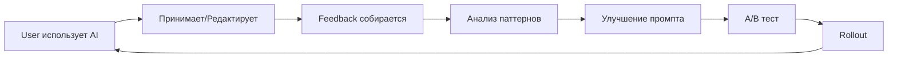

# 🤖 AI Prompts Library - MRM AI Platform

**Версия:** 1.0  
**Статус:** ✅ Production Ready  
**Обновлено:** 23 октября 2025

---

## 📚 Структура библиотеки

```
AI_Prompts_Library/
├── README.md (этот файл)
├── 01_Migration_Assistant/
│   ├── excel_field_detection.md
│   ├── template_matching.md
│   └── data_validation.md
├── 02_Media_Plan_Analyzer/
│   ├── plan_analysis.md
│   ├── recommendations.md
│   ├── budget_optimization.md
│   └── rossiter_percy_calculator.md
├── 03_Report_Generator/
│   ├── analytical_notes.md
│   ├── executive_summary.md
│   ├── trends_analysis.md
│   └── recommendations.md
├── 04_Project_Assistant/
│   ├── meeting_transcription.md
│   ├── postmeet_generation.md
│   ├── task_decomposition.md
│   └── status_updates.md
├── 05_Account_Assistant/
│   ├── client_communication.md
│   ├── brief_generation.md
│   └── email_responses.md
└── 06_Specialist_Assistant/
    ├── campaign_optimization.md
    ├── creative_analysis.md
    └── ad_copy_generation.md
```

---

## 🎯 Принципы написания промптов

### 1. Структура промпта
```yaml
Компоненты:
  1. Role (роль AI)
  2. Context (контекст задачи)
  3. Task (конкретная задача)
  4. Format (формат ответа)
  5. Examples (примеры, если нужно)
  6. Constraints (ограничения)
```

### 2. Best Practices
- ✅ Четкая роль и контекст
- ✅ Конкретная задача (не "проанализируй", а "определи ТОП-5 проблем")
- ✅ Формат ответа (JSON, Markdown, список)
- ✅ Примеры для few-shot learning
- ✅ Ограничения (длина, тон, стиль)

### 3. Тестирование
- Каждый промпт тестируется на 10+ примерах
- Измеряем: accuracy, relevance, consistency
- A/B тестирование разных версий
- Continuous improvement на основе feedback

---

## 📊 Метрики качества промптов

### KPI по каждому промпту
```yaml
Acceptance Rate:
  - Цель: >70%
  - Измерение: % AI ответов, принятых без правок

Edit Distance:
  - Цель: <20%
  - Измерение: % отредактированного текста от общего объема

Time Saved:
  - Цель: 5x faster
  - Измерение: Время с AI vs без AI

User Satisfaction:
  - Цель: NPS >40
  - Измерение: Опрос пользователей
```

---

## 🔄 Процесс обновления промптов

### Version Control
```yaml
Каждый промпт версионируется:
  v1.0 - Начальная версия
  v1.1 - Улучшение на основе feedback
  v2.0 - Значительные изменения

Changelog в каждом файле:
  - Что изменилось
  - Почему изменилось
  - Metrics до/после
```

### Feedback Loop


---

## 🚀 Использование в коде

### TypeScript Example
```typescript
import { getPrompt } from '@/lib/prompts';

// Загрузить промпт
const prompt = await getPrompt('media_plan_analyzer/plan_analysis', {
  variables: {
    media_plan: mediaPlanData,
    benchmark: benchmarkData
  }
});

// Использовать с OpenAI
const response = await openai.chat.completions.create({
  model: 'gpt-4-turbo-preview',
  messages: [
    { role: 'system', content: prompt.system },
    { role: 'user', content: prompt.user }
  ],
  temperature: prompt.temperature || 0.7,
  max_tokens: prompt.max_tokens || 2000
});
```

---

## 📖 Документация по промптам

Каждый файл промпта содержит:

### Метаданные
```yaml
name: "Название промпта"
version: "1.0"
category: "Migration Assistant"
model: "gpt-4-turbo-preview"
temperature: 0.7
max_tokens: 2000
created: "2025-10-23"
last_updated: "2025-10-23"
```

### Описание
- Что делает промпт
- Когда использовать
- Input/Output формат

### Промпт
- System prompt
- User prompt template
- Variables (placeholder для данных)

### Примеры
- 3-5 примеров использования
- Input → Output

### Метрики
- Acceptance rate
- Time saved
- User satisfaction

### Changelog
- История изменений
- Причины изменений

---

## 🎓 Training для команды

### Onboarding
1. Изучить принципы написания промптов
2. Прочитать 5+ примеров из библиотеки
3. Написать 1 промпт под супервизией
4. Review от senior AI engineer

### Continuous Learning
- Weekly prompt review sessions
- Sharing best practices
- A/B test results discussions

---

## 📊 Dashboard метрик

Доступен на: `/admin/ai/prompts-metrics`

Показывает:
- Acceptance rate по каждому промпту
- Top-5 best performers
- Bottom-5 needs improvement
- A/B test results
- Feedback от пользователей

---

## 🔐 Security & Compliance

### Data Privacy
- Промпты не содержат sensitive data
- Variables подставляются в runtime
- Логирование всех AI interactions (для audit)

### Rate Limiting
- Max 100 requests/minute per user
- Queue для bulk operations
- Graceful degradation при недоступности API

---

**Следующие файлы:** Детальные промпты по каждой категории


