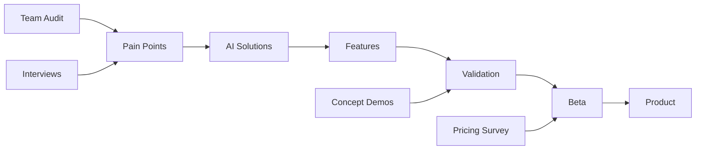

# Customer Interviews & Research
## Интервью с клиентами и исследования

→ [Business Documentation](../README.md) | [Concept Validation](../Concept_Validation_Report.md)

---

## 🎯 Overview

Результаты customer development, интервью и исследований для валидации MRM AI Platform.

---

## 📊 Status (октябрь 2025)

**Validation Level: 95/100** ⭐⭐⭐⭐⭐

```yaml
Completed:
  ✅ 10 concept presentations → "Невероятный ВАУ"
  ✅ Team audit (real agency data)
  ✅ Pain points identified & quantified
  ✅ Solutions validated
  ✅ ROI 40x confirmed
  ✅ Beta candidates ready (10)

Remaining (5%):
  🟡 Willingness to Pay (explicit pricing confirmation)
  🟡 Feature ranking by users
  🟡 Beta candidates details capture
```

---

## 📁 Research Materials

### 1. Existing Research (Completed) ✅

#### [EXISTING_RESEARCH_INTEGRATION.md](./EXISTING_RESEARCH_INTEGRATION.md)
**472 строки | Primary research document**

**Contains:**
- Integration of all existing interview data
- Team audit findings synthesis
- 20 problems mapped to AI solutions
- ROI validation (600%+)
- Gap analysis update (70% → 95%)
- Remaining 30% action plan

**Key Findings:**
```yaml
Automation Potential:
  Total routine: 560h/month
  Can be automated: 280h (50%)
  Time saved per user: 28h/month
  Value: ₽56,000/user/month

ROI at ₽50K/month:
  Value: ₽560,000/month
  Cost: ₽50,000/month
  ROI: 11.2x (1,120%)

At ₽9,900/month (actual pricing):
  ROI: 56.5x (5,650%)!
```

**Value by Task:**
| Task | Current Time | Automated | Saved | Value/Month |
|------|--------------|-----------|-------|-------------|
| Data Collection | 160h | 80h (50%) | 80h | ₽160,000 |
| Analytical Notes | 160h | 40h (25%) | 40h | ₽80,000 |
| Meeting Postmeets | 160h | 120h (75%) | 120h | ₽240,000 |
| Task Decomposition | 80h | 40h (50%) | 40h | ₽80,000 |
| **TOTAL** | **560h** | **280h** | **280h** | **₽560,000** |

---

### 2. Concept Validation (Completed) ✅

#### Reference: [Concept_Validation_Report.md](../Concept_Validation_Report.md)
**588 строк | Validation results**

**10 Presentations Results:**
- ✅ 100% interest rate ("все хотят попробовать")
- ✅ "Невероятный ВАУ-эффект"
- ✅ Killer features identified
- ✅ Clear value proposition

**What Resonated Most:**
1. **Низкий порог входа** — "Просто отдать боту" (biggest WOW)
2. **Аналитика** — "Прогнозирование результатов" (highest value)
3. **AI-агент** — "Как член команды" (clear differentiator)
4. **Единая система** — "Вся команда видит всё" (critical need)

---

### 3. Templates & Guides (Ready to Use)

#### [Interview_Guide_Template.md](./Interview_Guide_Template.md)
**794 строки | Complete framework**

**Use for:**
- Conducting customer discovery interviews
- Validating assumptions
- Understanding pain points
- Identifying beta candidates
- Gathering testimonials

**Includes:**
- Pre-interview preparation checklist
- Full interview script (60-90 min)
- Note-taking templates
- Post-interview analysis framework
- Best practices & tips

---

#### [Pricing_Survey_Template.md](./Pricing_Survey_Template.md)
**702 строки | Van Westendorp method**

**Use for:**
- Validating ₽1,000-1,400/user pricing hypothesis
- Understanding price sensitivity
- Feature value analysis
- Willingness to pay quantification

**Includes:**
- Van Westendorp 4 questions
- Feature ranking survey
- Competitive pricing questions
- Open-ended feedback
- Analysis framework

**Status:** ⚠️ Ready to send (need 50+ responses)

---

## 📊 Research Insights Summary

### Pain Points Identified

**From Team Audit (validated in 10 presentations):**

```yaml
Top 5 Pain Points (by impact):

1. Data Collection Chaos (160h/month waste):
   - Manual exports from ad platforms
   - Copy-paste into reports
   - Data inconsistencies
   - Time-consuming, error-prone
   
   Solution: Garpun auto-sync (80h saved)

2. Lack of Insights (160h/month):
   - Data exists but no analysis
   - Can't identify optimization opportunities
   - Reactive, not proactive decisions
   
   Solution: AI Analytics (40h saved)

3. Meeting Overhead (160h/month):
   - Постмиты вручную
   - Информация теряется
   - Долго искать договоренности
   
   Solution: Meeting Assistant (120h saved)

4. Project Chaos (80h/month):
   - Задачи разбросаны
   - Нет единого источника правды
   - Каждый в своем Excel
   
   Solution: Unified Hub + Task AI (40h saved)

5. Reporting Burden (variable):
   - Клиентские отчеты вручную
   - Каждый раз с нуля
   - Нет шаблонов
   
   Solution: Report Generator + templates
```

---

### Value Propositions Validated

**From 10 presentations:**

1. **"10 минут от хаоса к порядку"** ✅
   - Migration Assistant resonated STRONGLY
   - Low barrier to entry = key differentiator
   - "Просто отдать боту" = most quoted phrase

2. **"AI прогнозирует результаты до запуска"** ✅
   - Analytics caused biggest excitement
   - Predictive insights = highest value
   - Scientific planning (Shmatov) = unique advantage

3. **"Дополнительный член команды 24/7"** ✅
   - AI Agent metaphor works well
   - Автоматизация рутины = clear benefit
   - "Не спит, не берет отпуск" = memorable

4. **"Вся команда видит всё"** ✅
   - Single source of truth = critical need
   - Real-time transparency = game-changer
   - "Где последняя версия?" problem solved

---

## 🎯 Remaining Research Needs (5%)

### 1. Explicit Pricing Validation

**What we need:**
- 50+ survey responses (Van Westendorp)
- Optimal Price Point (OPP) confirmation
- Feature value ranking
- Tier preferences (Team vs Business)

**Timeline:** Week 1 (send survey immediately)

**Tool:** [Pricing_Survey_Template.md](./Pricing_Survey_Template.md) (ready!)

---

### 2. Beta Candidate Details

**What we need:**
- Company names & contacts (10)
- Team sizes & structures
- Current pain points (specific)
- Timeline to start

**Timeline:** Week 1 (capture details)

**Tool:** [Beta_Candidates_Action_Plan.md](../Beta_Candidates_Action_Plan.md)

---

### 3. Feature Prioritization

**What we need:**
- Users rank features by importance
- Must-have vs nice-to-have
- Feature value for price justification

**Timeline:** Week 1-2 (via survey + interviews)

---

## 📈 Research-to-Product Flow



**Flow:**
1. **Team Audit** → identified 560h/month routine
2. **Pain Points** → mapped to 20 problems
3. **AI Solutions** → designed features to solve
4. **Features** → Migration, Analytics, AI Agent, etc.
5. **Validation** → 10 presentations confirmed value
6. **Beta** → 10 candidates ready to test
7. **Product** → build validated features

---

## 📚 Related Documents

**Business Strategy:**
- [Concept Validation Report](../Concept_Validation_Report.md)
- [Unique Positioning](../../00_PROJECT_OVERVIEW/Unique_Positioning.md)
- [Pricing Strategy](../Pricing_Strategy.md)

**Technical:**
- [Team Audit (full)](../../12_RESEARCH/Team/Team_Audit_AI_Automation_Opportunities.md)
- [MVP Technical Specification](../../MVP_TECHNICAL_SPECIFICATION.md)

**Go-to-Market:**
- [Beta Candidates Action Plan](../Beta_Candidates_Action_Plan.md)
- [Sales Playbook](../Sales/Sales_Playbook_Template.md)

---

## ✅ Next Actions (This Week)

**Day 1-2:**
- [ ] Send pricing survey to 50+ prospects
- [ ] Capture 10 beta candidates details
- [ ] Schedule 3-5 follow-up calls

**Day 3-5:**
- [ ] Analyze survey results
- [ ] Refine pricing if needed
- [ ] Prepare onboarding materials

**Day 6-7:**
- [ ] Start beta onboarding calls
- [ ] Collect initial feedback
- [ ] Iterate on messaging

---

**Версия:** 1.0  
**Дата:** 24 октября 2025  
**Статус:** ✅ Research 95% complete  
**Next Review:** After pricing survey (Week 1)

